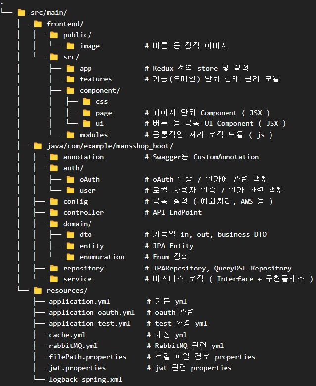
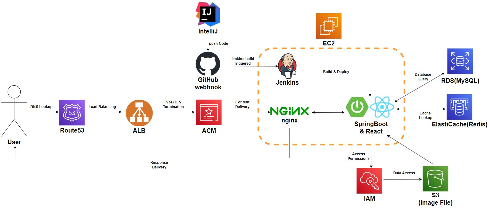
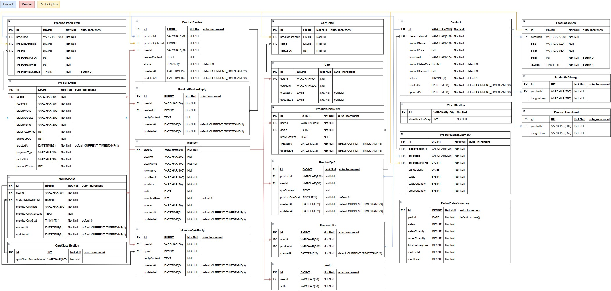

# Man's Shop


# 프로젝트 요약

> 소규모 개인 의류 쇼핑몰이라는 기획으로 진행한 개인 프로젝트입니다.   
> 초기 버전인 JDK 8, Spring MVC, MyBatis, Oracle, JSP 기반의 프로젝트를 JDK 17, Spring Boot 3, MySQL, React( jsx ) 환경에서 재구현했습니다.   
> JSP 버전은 마무리 이후 유지하고 있는 상태지만, 해당 버전은 지속적인 리팩토링과 기능 추가를 수행하고 있습니다.   
> 쇼핑몰에서 볼 수 있는 기본적인 상품 정보, 장바구니, 결제, 마이페이지, 로그인 ( 로컬 및 OAuth2 ) 기능들을 구현했으며, 관리자의 기능들은 예상되는 기능들을 설계해 구현했습니다.

### JSP 버전 github
* https://github.com/Youndae/mansShop

<br />

# 목차
<strong>1. [프로젝트 구조](#프로젝트-구조)</strong>   
<strong>2. [개발 환경](#개발-환경)</strong>   
<strong>3. [Architecture Diagram](#Architecture-Diagram)</strong>   
<strong>4. [ERD](#ERD)</strong>   
<strong>5. [페이지별 기능 상세](#페이지별-기능-상세)</strong>   
<strong>6. [기능 및 개선 내역](#기능-및-개선-내역)</strong>

<br/>

# 프로젝트 구조



* React 기반 Frontend와 Java, Spring Boot 기반 Backend의 통합 빌드
  * Gradle build를 통해 frontend가 같이 빌드
  * 백엔드에서 WebController라는 이름의 컨트롤러를 통해 forward:index.html을 반환
  * Frontend에서는 Axios를 통한 통신
* Frontend 구조 설계
  * src/main/frontend에 위치
  * public/image에 버튼 등의 정적 이미지 파일을 배치
  * src/app과 src/features에 Redux 관련 store 및 설정, 상태 관리 모듈을 배치
  * src/component 하위에 css, page, ui로 나눠주고 page는 각 페이지 Component들을 배치. UI에서는 기본 버튼, 페이지네이션 버튼 등의 UI 관련 Component를 배치함으로써 재사용성 증대
  * src/modules에 공통 처리 로직들을 분리해 모듈화 함으로써 코드 중복 최소화
* Backend 구조 설계
  * annotation, auth, config, controller, domain, repository, service 구조로 설계
  * 각 Layer 별 분리를 기반으로 패키지 구조 설계
  * domain의 경우 dto 패키지내부에서 기능별로 패키지를 나누고 그 안에서 다시 요청, 응답, 비즈니스로직 별로 패키지를 분리해 책임을 명확히 할 수 있도록 설계
* Project Architecture
  * Spring의 기본적인 Layerd Architecture 구조.
  * Controller - Service ( Interface와 구현체 ) - Repository

<br />

# 개발 환경
|Category|Tech Stack|
|---|---|
|Backend| - Spring Boot 3.2.5 <br/> - JDK 17 <br/> - Gradle <br/> - Spring Data JPA <br/> - QueryDSL <br/> - RabbitMQ 3.12 Management <br/> - SpringSecurity <br/> - JWT <br/> - OAuth2(Google, Kakao, Naver) <br/> - Swagger( springdoc-openapi 2.6.0 ) <br/> - Java Mail <br/> - I'mport 결제 API ( iamport-rest-client ) |
|Frontend| - React 18.3.1 <br/> - Axios <br/> - reduxjs/toolkit <br/> - react-redus <br/> - redux-persist <br/> - react-dom <br/> - http-proxy-middleware <br/> - styled-components <br/> - dayjs <br/> - Kakao 우편번호 서비스 API ( react-daum-postcode ) |
|Database| - MySQL <br/> - Redis|
|Environment| - IntelliJ <br/> - GitHub <br/> - Docker ( MySQL, Redis, RabbitMQ )|

<br />

# Architecture Diagram


<br/>
<br/>

<strong>
이 프로젝트는 배포 테스트를 수행했습니다. AWS 환경에서 수행했으며 GitHub Webhook과 Jenkins를 통해 push 이벤트 감지를 통한 자동 배포 및 빌드까지 구축했습니다.<br/>
RabbitMQ의 경우 도입 이전 배포 테스트 수행으로 인해 RabbitMQ에 대한 처리는 workflow에 빠져있는 상태입니다.
</strong>

<br/>
<br/>

# ERD


<br/>


# 페이지별 기능 상세

<details>
  <summary><strong>메인 화면</strong></summary>

  * BEST, NEW, 상품 분류별 목록 출력
  * 상품 리스트 페이징
  * 상품명 검색
  * 장바구니
    * 장바구니 상품 수량 증감
    * 장바구니 상품 선택 또는 전체 삭제
    * 장바구니 상품 선택 또는 전체 구매
  * 주문 조회(비 로그인시에만 출력. 로그인 시 마이페이지에서 조회 가능)
  * 로그인
    * 회원가입
    * 로컬 로그인 및 OAuth2 로그인 ( Google, Kakao, Naver )
    * 아이디 및 비밀번호 찾기 ( 비밀번호 찾기 기능은 Mail로 인증번호 전송을 통한 인증 이후 처리 )
    * 로그아웃
  * 비회원
    * 장바구니( Cookie 기반 )
    * 주문 및 결제
    * 주문 내역 조회 ( 받는사람, 연락처 기반 )
</details>

<br/>

<details>
  <summary><strong>상품 상세</strong></summary>

* 상품 정보 출력
* 상품 옵션 선택
* 장바구니 담기
* 관심상품 등록
* 선택 상품 수량 증감
* 선택 상품 결제
* 상품 리뷰 리스트
* 상품 문의 목록 출력 및 작성
</details>

<br/>

<details>
  <summary><strong>마이페이지</strong></summary>

* 주문 목록
  * 배송완료 상품 리뷰 작성
* 관심 상품 목록
* 문의 내역
  * 상품 문의 내역
    * 문의 상세 정보
    * 문의 삭제
  * 회원 문의 내역
    * 문의 작성
    * 문의 상세 정보
      * 답변 작성
      * 문의 삭제
* 작성한 리뷰 목록
  * 작성한 리뷰 상세 및 삭제
  * 리뷰 수정
* 정보 수정
</details>

<br/>

<details>
  <summary><strong>관리자 페이지</strong></summary>

* 상품 관리
  * 상품 목록
  * 상품 검색
  * 상품 추가 및 수정
  * 상품 상세 정보
  * 재고 관리
  * 할인 설정
* 주문 관리
  * 미처리 주문 목록
    * 주문 정보
    * 주문 확인 처리
    * 미처리 주문 검색 ( 받는사람 or 사용자 아이디 )
  * 전체 주문 목록
    * 주문 정보
    * 전체 주문 검색 ( 받는사람 or 사용자 아이디 )
* 문의 관리
  * 상품 문의 관리
    * 미답변 상품 문의 목록
    * 전체 상품 문의 목록
    * 상품 문의 상세 정보
    * 상품 문의 답변 작성
    * 상품 문의 완료 처리
    * 상품 문의 검색 ( 닉네임 and 아이디 )
  * 회원 문의 관리
    * 미답변 회원 문의 목록
    * 전체 회원 문의 목록
    * 회원 문의 상세 정보
    * 회원 문의 답변 작성
    * 회원 문의 완료 처리
    * 회원 문의 검색 ( 닉네임 and 아이디 )
  * 회원 문의 카테고리 설정
    * 카테고리 추가, 삭제
* 회원 관리
  * 회원 목록
  * 회원 상세 정보
    * 회원 주문 목록 조회
    * 회원 상품 문의 내역 조회
    * 회원 문의 내역 조회
* 매출 관리
  * 기간별 매출
    * 선택 연도 월별 매출 목록 및 연매출, 판매량, 주문량
    * 월 매출 상세 정보
      * 베스트 5 상품, 분류별 매출, 일별 매출
      * 분류별 상세 매출
      * 선택 날짜의 전체 주문 내역 조회
  * 상품별 매출
    * 상품별 매출 목록
    * 검색 ( 상품명 )
    * 상품별 매출 상세 정보
      * 옵션별 매출 내역
</details>

<br/>

# 기능 및 개선 내역

### 목차
* <strong>백엔드</strong>
  1. [JMeter 테스트 수행 및 결과](#JMeter-테스트-수행-및-결과)
  2. [OAuth2 요청 및 토큰 발급 처리](#OAuth2-요청-및-토큰-발급-처리)
  3. [인증 인가 처리](#인증-인가-처리)
  4. [주문 및 매출 집계 처리 개선 RabbitMQ 적용](#주문-및-매출-집계-처리-개선-RabbitMQ-적용)
  5. [RabbitMQ 실패 메시지 재처리](#RabbitMQ-실패-메시지-재처리)
  6. [쿼리 튜닝](#쿼리-튜닝)
  7. [count 쿼리 캐싱](#count-쿼리-캐싱)
  8. [상품 추가 및 수정에서 JPA 이슈와 파일관리](#상품-추가-및-수정에서-JPA-이슈와-파일관리)
  9. [S3 연결을 통한 이미지 출력 처리](#S3-연결을-통한-이미지-출력-처리)
  
<br/>

* <strong>프론트 엔드</strong>
  1. [Redux를 통한 로그인 상태 관리](#Redux를-통한-로그인-상태-관리)
  2. [Axios Interceptor](#Axios-Interceptor)
  3. [상품 옵션 입력 폼 동적 생성 및 삭제](#상품-옵션-입력-폼-동적-생성-및-삭제)


<br/>

## 백엔드


### JMeter 테스트 수행 및 결과
<br />

리팩토링 이후 JMeter를 통한 테스트를 진행했습니다.   
테스트 목적은 기능에 대한 성능 최적화입니다.   
사용하지 않는 구형 노트북에 Ubuntu 24.04.01을 설치한 뒤 Docker로 MySQL, Redis, RabbitMQ를 사용해 배포했습니다.   
JMeter는 데스크탑에서 실행했고 공유기로 인한 같은 로컬 환경에서의 테스트로 진행했습니다.   

테스트 데이터로는 사용자 및 상품 데이터 2000개 가량, 그 외 테이블들은 250만개 이상의 더미데이터를 담아두고 테스트했습니다.   
테스트 설정은 500 Thread, 5 Ramp-up, Loop count 1 환경에서 수행했으며, 관리자의 경우 상대적으로 요청이 적게 발생하는 만큼 20 Thread, 1 Ramp-up 환경으로 수행했습니다.   
이 설정은 가장 원활하게 처리되던 메인 페이지 조회 기능 기준으로 여러 수치에 대한 테스트를 진행하며 결정하게 되었습니다.   
평균적으로 200ms를 넘어가지 않는 기능이었지만, 500 Thread가 넘는 수치에서는 1500ms 이상의 비정상적으로 치솟는 결과를 볼 수 있었기에 최적화에 가장 적합한 최대치라고 생각했습니다.   

하단의 이미지는 테스트 결과를 정리한 엑셀 파일의 일부입니다.   
가장 문제가 많아 최적화를 많이 수행한 부분이 관리자 파트였기 때문에 관리자 기능 위주로 자료를 준비했습니다.   

테스트의 통과 기준은 평균 500ms대 까지로 잡았고, 목표에 맞춰 최적화를 수행했습니다.   
최적화는 데이터베이스 인덱싱, 쿼리 튜닝, 코드 레벨에서의 데이터 파싱 및 JPA 최적화를 수행했으며, 모든 요청에 대해 목표를 달성할 수 있었습니다.   

이 테스트를 수행하기 이전 브라우저나 Postman을 통한 단일 요청 테스트에서는 모두 정상적인 수치를 보여주던 기능들이었지만, 운영 환경과 같은 다중 요청이 발생하는 경우 또 다른 결과를 볼 수 있다는 점을 알 수 있게 된 좋은 기회였습니다.
또한, 쿼리 튜닝과 인덱싱, JPA에 대해 좀 더 깊게 고민할 수 있었습니다.


<br />

### OAuth2 요청 및 토큰 발급 처리
<br />


로그인 처리로는 페이지에서 회원 가입후 로그인하는 로컬 로그인과 OAuth2 로그인이 있습니다.   
OAuth2 로그인은 Google, Naver, Kakao 세가지로 처리했으며 요청은 Frontend에서 window.location.href를 통해 요청하도록 했습니다.

```javascript
const handleOAuth = (e) => {
    const OAuthClient = e.target.name;
    
    window.sessionStorage.setItem('prev', state.toString());
    
    if(oAuthClient === 'google')
        window.location.href = 'http://localhost:8080/oauth2/authorization/google';
    else if(oAuthClient === 'naver')
        window.location.href = 'http://localhost:8080/oauth2/authorization/naver';
    else if(oAuthClient === 'kakao')
        window.location.href = 'http://localhost:8080/oauth2/authorization/kakao';
}
```

href 요청 이전 state에 이전 페이지 데이터를 담도록 처리했습니다.   
일반적인 로그인 요청에서는 200 응답을 받아 바로 이동하는 것이 가능하지만 href 요청의 경우 어렵기 때문입니다.   
그래서 SessionStorage에 담아두었다가 처리 완료 후 꺼내 처리할 수 있도록 설계했습니다.

서버에서는 OAuth2 인증 정보들을 application-oauth.yml에 저장해두었습니다.   
처리 과정중에 사용될 SimpleUrlAuthenticationSuccessHandler와 OAuth2User, DefaultOAuth2UserService는 customizing 처리해서 사용했습니다.   
SpringFilterChain Bean에서 oauth2Login 설정을 통해 OAuth2UserService와 SuccessHandler를 처리할 수 있도록 설정해두었습니다.

```java
//CustomOAuth2UserService
@Service
@RequiredArgsConstructor
public class CustomOAuth2UserService extends DefaultOAuth2UserService {
    private final MemberRepository memberRepository;

  @Override
  public OAuth2User loadUser(OAuth2UserRequest userRequest) throws OAuth2AuthenticationException {
    OAuth2User oAuth2User = super.loadUser(userRequest);
    String registrationId = userRequest.getClientRegistration().getRegistrationId();
    OAuth2Response oAuth2Response = null;

    if(registrationId.equals(OAuthProvider.GOOGLE.getKey()))
      oAuth2Response = new GoogleResponse(oAuth2User.getAttributes());
    else if(registrationId.equals(OAuthProvider.NAVER.getKey()))
      oAuth2Response = new NaverResponse(oAuth2User.getAttributes());
    else if(registrationId.equals(OAuthProvider.KAKAO.getKey()))
      oAuth2Response = new KakaoResponse(oAuth2User.getAttributes());

    String userId = oAuth2Response.getProvider() + "_" + oAuth2Response.getProviderId();
    Member existsData = memberRepository.findById(userId).orElse(null);

    if(existsData == null) {
      Member member = OAuth2ResponseEntityConverter.toEntity(oAuth2Response, userId);
      member.addMemberAuth(
              Auth.builder()
                      .auth(Role.MEMBER.getKey())
                      .build()
      );

      memberRepository.save(member);

      existsData = member;
    }else {
      existsData.setUserEmail(oAuth2Response.getEmail());
      existsData.setUserName(oAuth2Response.getName());

      memberRepository.save(existsData);
    }

    OAuth2DTO oAuth2DTO = new OAuth2DTO(existsData);

    return new CustomOAuth2User(oAuth2DTO);
  }
}
```

각 Authorization Server 대한 처리를 공통적으로 처리할 수 있도록 OAuth2Response라는 인터페이스를 통해 처리하도록 설계했습니다.   
이 설계를 통해 추후 새로운 Authorization Server가 추가되더라도 유연하게 대응할 수 있습니다.   
응답 데이터를 처리한 뒤 provider 컬럼에 각 Authorization Server provider를 담게 되며 새로운 사용자인 경우 데이터를 새로 저장, 기존 사용자인 경우 Authorization Server로 부터 받은 데이터 기반으로 갱신을 처리하게 됩니다.   
이후 OAuth2DTO에 담아 CustomOAuth2User를 생성하고 반환해 처리가 완료된 이후 SuccessHandler에 접근합니다.

```java
// CustomOAuth2SuccessHandler

@Component
@RequiredArgsConstructor
@Slf4j
public class CustomOAuth2SuccessHandler extends SimpleUrlAuthenticationSuccessHandler {

  private final JWTTokenProvider jwtTokenProvider;

  @Override
  public void onAuthenticationSuccess(HttpServletRequest request
                                      , HttpServletResponse response
                                      , Authentication authentication) 
                                                  throws IOException, ServletException {
    CustomOAuth2User customOAuth2User = (CustomOAuth2User) authentication.getPrincipal();
    String userId = customOAuth2User.getUserId();
    jwtTokenProvider.createTemporaryToken(userId, response);

    response.sendRedirect("/oAuth");
  }
}
```
```javascript
//Oauth.jsx

useEffect(() => {
  tokenRequest();
}, []);

const tokenRequest = async () => {

  await axiosInstance.get('member/oAuth/token')
          .then(res => {
            const authorization = res.headers.get('authorization');
            window.localStorage.setItem('Authorization', authorization);

            const prevUrl = window.sessionStorage.getItem('prev');
            navigate(prevUrl);
          })
}
```

SuccessHandler에서는 사용자 아이디를 기반으로 임시 토큰을 생성한 뒤 응답 쿠키에 토큰을 담아 /oAuth 경로로 Redirect 합니다.      
그럼 Oauth 컴포넌트로 접근하게 되는데 이 컴포넌트는 아무런 UI를 처리하지 않는 컴포넌트입니다.   
단지 랜더링 시점에 useEffect를 통해 임시 토큰을 담아 정식 토큰 발급 요청을 보내게 되고, 정상적으로 토큰이 발급 되었다면 SessionStorage에 담아두었던 prev를 꺼내 로그인 이전 페이지로 이동하게 됩니다.   
이때, 발급 받은 토큰의 처리는 Axios Interceptor에 의해 처리되는데, Frontend 기능 내역에 따로 정리해두었습니다.   

Redirect를 처리할 때 Authorization 헤더에 토큰을 담는 것은 보안상 적절하지 않다고 생각해 이렇게 처리했습니다.   
서버의 특정 요청 경로를 만들고 처리하는 방법도 테스트해봤지만 원하는 방법으로 해결할 수 없어 UI가 없는 컴포넌트를 통해 처리하게 되어 아쉬움이 남는 기능입니다.

<br />

### 인증 인가 처리
<br />

인증 인가 처리는 JWT와 Spring Security를 같이 사용했습니다.   
SpringSecurity는 검증된 토큰을 기반으로 Authentication 객체를 SecurityContextHolder.setAuthentication()을 통해 담아 관리하게 됩니다.   
권한 관리는 컨트롤러 혹은 메소드 단위로 @PreAuthorize Annotation을 통해 관리합니다.   

JWT는 AccessToken과 RefreshToken 구조로 설계했습니다.   
또한, 다중 디바이스 로그인을 허용하기 위해 ino라는 디바이스 식별 목적의 값이 같이 처리되는 구조입니다.   
AccessToken은 1시간, RefreshToken은 2주의 만료기간을 갖도록 처리했으며, ino는 JWT로 생성하는 것이 아니기 때문에 자체적인 만료 기간은 없습니다.   

서버에서의 토큰 관리는 Redis로 관리하게 됩니다.   
이때 key 구조는 at 또는 rt 라는 각 토큰의 약어로 시작합니다. 토큰 약어 + ino + 사용자 아이디 구조로 키값을 생성하게 됩니다.   
클라이언트에서는 AccessToken을 LocalStorage에 보관하며 RefreshToken과 ino는 쿠키로 관리합니다.   
쿠키 만료시점은 토큰 만료 시간과 다르게 30일을 갖게 되며, ino는 9999일의 긴 기간을 주어 사실상 만료되지 않도록 설계했습니다.   
클라이언트의 만료 시간을 길게 설계한데는 탈취 대응에 대한 이유가 있습니다.   
만약 사용자의 미접속 기간이 토큰 만료시간보다 길어졌을 때, 탈취를 당했다면 Redis 데이터와 비교를 통해 판단할 수 있기 때문입니다.   
ino가 제거되지 않는 한 해당 디바이스의 Redis Key 구조는 동일할 것이기 때문에 이 과정에서 비교를 통해 탈취 여부를 판단할 수 있게 됩니다.   
ino의 경우 절대 사라지지 않는 값은 아니며, 로그아웃이나 탈취로 판단되는 경우 서버에서 만료 쿠키를 응답에 담아 반환함으로써 제거하게 됩니다.   

서버에서 응답할 때 AccessToken은 Authorization Header에 담아 반환하게 되며, RefreshToken과 ino는 응답 쿠키에 담아 반환합니다.   
이때, 쿠키 설정으로는 SameSite Strict, HttpOnly, Secure 설정을 하도록 설계했습니다.   

재발급 방식은 Refresh Token Rotation 방식으로 처리해 긴 만료시간을 갖는 Refresh Token의 단점을 상쇄할 수 있도록 했습니다.


```java
@Override
protected void doFilterInternal(HttpServletRequest request,
                                HttpServletResponse response,
                                FilterChain chain) throws ServletException, IOException {
  
    String accessToken = request.getHeader(accessHeader);
    Cookie refreshToken = WebUtils.getCookie(request, refreshHeader);
    Cookie inoToken = WebUtils.getCookie(request, inoHeader);
    String username = null; // Authentication 객체 생성 시 필요한 사용자 아이디
  
    if(inoToken != null){
      String inoValue = inoToken.getValue();
      if(accessToken != null && refreshToken != null) {
        String refreshTokenValue = refreshToken.getValue();
        String accessTokenValue = accessToken.replace(tokenPrefix, "");
  
        if(!jwtTokenProvider.checkTokenPrefix(accessToken)
                || !jwtTokenProvider.checkTokenPrefix(refreshTokenValue)){
          chain.doFilter(request, response);
          return;
        }else {
          String claimByAccessToken = jwtTokenProvider.verifyAccessToken(accessTokenValue, inoValue);
  
          if(claimByAccessToken.equals(Result.WRONG_TOKEN.getResultKey())
                  || claimByAccessToken.equals(Result.TOKEN_STEALING.getResultKey())){
            jwtTokenService.deleteCookieAndThrowException(response);
            return;
          }else if(claimByAccessToken.equals(Result.TOKEN_EXPIRATION.getResultKey())){
            if(request.getRequestURI().equals("/api/reissue")) {
              chain.doFilter(request, response);
            }else
              jwtTokenService.tokenExpirationResponse(response);
  
            return;
          }else {
            username = claimByAccessToken;
          }
        }
      }else if(accessToken != null && refreshToken == null){
        String decodeTokenClaim = jwtTokenProvider.decodeToken(accessToken.replace(tokenPrefix, ""));
  
        jwtTokenService.deleteTokenAndCookieAndThrowException(decodeTokenClaim, inoValue, response);
        return;
      }else {
        chain.doFilter(request, response);
        return;
      }
    }
  
    if(username != null){
      Member memberEntity = memberRepository.findByUserId(username);
      String userId;
      Collection<? extends GrantedAuthority> authorities;
      CustomUserDetails userDetails;
  
      if(memberEntity.getProvider().equals("local"))
        userDetails = new CustomUser(memberEntity);
      else
        userDetails = new CustomOAuth2User(
                memberEntity.toOAuth2DTOUseFilter()
        );
  
      userId = userDetails.getUserId();
      authorities = userDetails.getAuthorities();
  
      Authentication authentication =
              new UsernamePasswordAuthenticationToken(userId, null, authorities);
  
      SecurityContextHolder.getContext().setAuthentication(authentication);
    }
  
    chain.doFilter(request, response);
}
```

SecurityFilterChain 설정에서 beforeFilter에 JWTAuthorizationFilter를 설정해 두었기 떄문에 모든 요청은 위 필터를 거치게 됩니다.   
처리 과정에서 가장 먼저 ino 존재 여부를 확인하게 되는데 ino가 없는 경우 토큰 검증은 가능하지만 Redis 데이터와 비교가 불가능하기 때문에 검증을 수행하지 않고 인증 처리를 하지 않도록 설계했습니다.   

ino가 존재한다면 토큰 검증 및 Redis 데이터와 비교를 처리하게 됩니다.   
조건에 따라 검증이 안되는 잘못된 토큰 혹은 Redis 데이터와 불일치 하는 탈취라고 판단되는 토큰, 정상 토큰으로 나눠집니다.   
잘못된 토큰이라는 응답의 경우 토큰은 있으나 Redis 데이터가 없거나, 토큰 검증이 실패한 토큰입니다.   
이 경우 Redis 데이터 처리가 불가능하기 때문에 응답 쿠키로 만료된 쿠키들을 담아준 뒤 800이라는 상태값과 함께 바로 응답을 반환하게 됩니다.   
탈취로 판단된 토큰의 경우 동일하게 응답 쿠키에 만료된 쿠키들을 담아주고 Redis 데이터까지 삭제한 뒤 800이라는 상태값과 함께 바로 응답을 반환하게 됩니다.   
800 응답을 받은 클라이언트에서는 LocalStorage에 저장된 AccessToken을 제거하고 인증 과정에서 문제가 있었음을 사용자에게 알려 재로그인을 유도합니다.   
쿠키의 경우 응답 쿠키가 바로 적용되기도 하고 HttpOnly 설정으로 인해 제어할 수 없으므로 따로 처리하지 않습니다.   

토큰이 정상으로 판단되는 경우 RDB 데이터를 조회한 뒤 Authentication 객체 생성 및 SecurityContextHolder에 담아 관리하도록 처리합니다.   

<br />

### 주문 및 매출 집계 처리 개선 RabbitMQ 적용
<br />

Spring Boot 버전으로 새로 진행하면서 기존에 있던 집계 테이블은 제거했습니다.   
매출 기능에 대해 다양한 데이터를 보여주도록 개선하게 되면서 집계 테이블의 효율성이 떨어졌기 때문에 주문 및 상세 테이블에서의 집계 쿼리로 처리했습니다.   
단일 요청에서 준수한 성능을 보여줬기에 이 설계를 유지하고 있었는데 JMeter로 다중 요청 테스트를 진행해보니 측정 불가 수준의 성능 문제가 발생했습니다.
이 문제를 해결하기 위해 인덱싱과 쿼리 튜닝을 진행해봤지만 해결할 수 없었기에 집계 테이블을 다시 설계하게 되었고, 일별 집계 테이블과 상품 옵션별 월 매출 집계 테이블로 나눠 추가했습니다.   

매출 기능은 이 개선을 통해 해결할 수 있었지만, 이 처리로 인해 주문 처리의 복잡도가 증가했습니다.   
주문 데이터 처리, 장바구니 데이터 처리, 상품 총 판매량 수정 처리, 옵션별 재고 수정, 2개의 집계 테이블에 대한 처리까지 모두 포함되어야 했습니다.   
하지만 사용자 입장에서 보면 주문 데이터 처리와 장바구니 데이터 처리만 관심사일 뿐, 다른 처리들은 사용자의 관심밖의 일이라고 생각해 이걸 기다리도록 처리하는건 비효율적이라고 생각했습니다.   

이 문제를 해결하기 위한 방법으로 Batch 처리와 비동기 처리 방식를 생각할 수 있었습니다.   
하지만, 매출과 재고, 판매량의 실시간성이 보장되어야 한다는 점에서 Batch 처리는 적합하지 않았고, 비동기 처리 중 방법을 찾게 되었습니다.   
비동기 처리 방식으로는 @Async Annotation을 통한 처리와 MessageBroker를 사용하는 방법으로 나눌 수 있었습니다.   
@Async의 경우 비교적 간결한 설정으로 사용할 수 있다는 장점이 있었으나, 처리 과정 중 발생한 오류에 대응하기 어렵다는 단점이 있었습니다.   
반면, MessageBroker는 설정은 조금 복잡하더라도 실패 메시지 관리와 재시도 처리가 용이하다는 이점이 있어 MessageBroker를 선택했습니다.   
MessageBroker 중 RabbitMQ를 선택하게 되었는데 다른 선택지였던 Kafka는 목적에 비해 복잡하기도 하고 오버 스펙에 즉시처리가 RabbitMQ에 비해 떨어진다고 생각했습니다.   
그래서 즉시 처리가 더 수월하며 Dead Letter Queue 기능을 통한 실패 메시지 관리의 편의성을 갖고 있는 RabbitMQ를 적용해 문제를 해결했습니다.

RabbitMQ의 Exchange, Queue, DLQ의 name 또는 Routing Key는 모두 rabbitMQ.yml에서 관리하도록 처리했으며, RabbitMQProperties 클래스를 통해 사용할 수 있도록 처리했습니다.   
또한, 필요한 값의 유연한 조회를 처리하기 위해 RabbitMQPrefix라는 Enum을 생성해 같이 관리합니다.

```java
//RabbitMQPrefix
@Getter
@RequiredArgsConstructor
public enum RabbitMQPrefix {
    EXCHANGE_ORDER("order"),
    QUEUE_ORDER_PRODUCT("orderProduct"),
    QUEUE_ORDER_PRODUCT_OPTION("orderProductOption"),
    QUEUE_PERIOD_SUMMARY("periodSalesSummary"),
    QUEUE_PRODUCT_SUMMARY("productSalesSummary"),
    QUEUE_ORDER_CART("orderCart");
  
    private final String key;
}

//RabbitMQProperties
@Component
@ConfigurationProperties(prefix = "rabbitmq")
public class RabbitMQProperties {
    private Map<String, Exchange> exchange;
    
    private Map<String, Queue> queue;
    
    //getter, setter
    //...
  
    
    private static class Exchange {
        private String name;
        private String dlq;
        //getter, setter
        //...
    }
    
    public static class Queue {
        private String name;
        private String routing;
        private string dlq;
        private String dlqRouting;
        //getter, setter
        //...
    }
}
```

이 처리를 통해 rabbitMQProperties.getQueue().get(rabbitMQPrefix.getKey()).getRouting(); 과 같은 코드를 통해 바로 Routing Key를 사용할 수 있습니다.   

현재 RabbitMQ가 적용되어 있는 기능은 주문 처리 기능밖에 없기 때문에 별도의 Producer를 두지 않고 메소드에서 바로 convertAndSend()를 통해 호출하게 됩니다.   
RabbitMQ의 기본적인 설정들과 Queue 정의는 RabbitMQConfig 클래스에 정의해두었으며, 아래 링크를 통해 전체 코드를 확인하실 수 있습니다.

<a href="https://github.com/Youndae/mansshop_boot/blob/master/src/main/java/com/example/mansshop_boot/config/rabbitMQ/config/RabbitMQConfig.java">RabbitMQConfig 전체 코드</a>

<br />

### RabbitMQ 실패 메시지 재처리

<br/>

RabbitMQ를 사용한 이유중 하나는 실패 메시지 관리 및 재시도 용이성입니다.   
그래서 이 실패 메시지 관리를 어떻게 할지 고민을 해봤습니다.   

실패 메시지 처리는 Management를 사용하는 만큼 관리자의 수동 처리를 하는 방법이 있고, 로그를 확인 후 재처리를 하는 방법도 있습니다.   
여러 방법 중 저는 UI를 통해 재처리 요청으로 수행하는 방법을 택했습니다.   
운영을 담당하는 개발자가 있는 경우에는 처리 방안이 다양하지만, 개발 후 제공만 하는 경우에는 제한적이라고 생각했기 때문입니다.   

기본적인 기능 설계로는 메시지 개수 조회, 재처리 요청 순으로 처리할 수 있도록 가닥을 잡았습니다.   
여러 조회 테스트와 재처리 테스트를 수행해보고 방법을 택하게 되었는데 그 중 HTTP 요청을 통한 조회, receive()를 통한 재처리로 결정하게 되었습니다.   

HTTP 요청을 통한 조회의 경우 두가지 경로가 존재했습니다.   
'/api/queues/{vhost}/{queueName}/get' 요청과 '/api/queues/{vhost}/{queueName}' 요청으로 두가지 방법이 있는데 차이점으로는 /get의 경우 메시지내용까지 가져온다는 차이점이 있습니다.   
만약 조회 즉시 재처리 요청을 수행해야 한다면 /get으로 처리하는 방법이 더 유효할 것이라고 생각합니다.   
receive()나 HTTP 요청을 통한 추가 조회 및 재처리 요청이 발생하지 않아도 되고 메시지 데이터를 파싱해 바로 브로커에게 메시지를 넘겨줄 수 있기 때문입니다.   
하지만 제가 원하는 기능은 관리자가 재처리 버튼을 눌렀을 때 재처리를 시도하는 것이 목적이었기 때문에 적합하지 않다고 생각했고, 메시지 내용 없이 단순히 개수만 반환하는 요청을 사용했습니다.   

```java
@Service
@RequiredArgsConstructor
public class AdminServiceImpl implements AdminService {
    
    private final RabbitMQProperties rabbitMQProperties;

    @Value("${spring.rabbitmq.username}")
    private String rabbitMQUser;
  
    @Value("${spring.rabbitmq.password}")
    private String rabbitMQPw;
    
    //...
  
    @Override
    public List<FailedQueueDTO> getFailedMessageList() {
        List<String> dlqNames = rabbitMQProperties.getQueue().values()
                                          .stream()
                                          .map(RabbitMQProperties.Queue::getDlq)
                                          .toList();
        List<FailedQueueDTO> result = new ArrayList<>();
        
        for(String name : dlqNames) {
            int messageCount = getFailedMessageCount(name);
            
            if(messageCount > 0)
                result.add(new FailedQueueDTO(name, messageCount));
        }
      
        return result;
    }
  
    private int getFailedMessageCount(String queueName) {
        WebClient webClient = WebClient.builder()
                .baseUrl("http://localhost:15672")
                .defaultHeaders(headers -> headers.setBasicAuth(rabbitMQUser, rabbitMQPw))
                .build();

      return (int) webClient.get()
                            .uri(builder ->
                                    builder.path("/api/queues/{vhost}/{queueNames}")
                                            .build("/", queueName)
                            )
                            .retrieve()
                            .bodyToMono(Map.class)
                            .block()
                            .get("messages");
    }
}
```

모든 Queue에 대한 정보를 담고 있는 RabbitMQProperties를 사용해 모든 DLQ 명을 리스트화 한 뒤 요청을 반복적으로 보내 메시지 개수를 조회했습니다.   
이후 메시지가 존재하는 DLQ명과 개수만 담아 클라이언트에게 반환하게 됩니다.

그럼 클라이언트에서는 실패 메시지가 존재하는 것을 확인 후 재처리 버튼을 통해 요청을 보내게 되면 Request Body에 조회 요청 시 반환된 데이터를 그대로 담아서 보내게 됩니다.   

```java
@Override
public String retryFailedMessages(List<FailedQueueDTO> queueDTOList) {
    //TODO: 추후 알림 기능 추가할 때 모든 메시지 처리에 대한 알림 발송하도록 개선.
    queueDTOList.forEach(this::retryMessages);

    return Result.OK.getResultKey();
}

private void retryMessages(FailedQueueDTO dto) {
    for(int i = 0; i < dto.messageCount(); i++) {
        Message message = rabbitTemplate.receive(dto.queueName());
        if(message != null) {
            Object data = converter.fromMessage(message);
            Map<String, Object> headers = message.getMessageProperties().getHeaders();
            List<Map<String, Object>> xDeathList = (List<Map<String, Object>>) headers.get("x-death");

            if(xDeathList != null && !xDeathList.isEmpty()) {
                Map<String, Object> xDeath = xDeathList.get(0);
                String exchange = (String) xDeath.get("exchange");
                List<String> routingKeyList = (List<String>) xDeath.get("routing-keys");
                String routingKey = routingKeyList.get(0);
                rabbitTemplate.convertAndSend(exchange, routingKey, data);
            }
        }
    }
}
```

서버는 클라이언트로부터 전달받은 리스트를 기반으로 재처리 요청을 시도하게 되는데 이때 메시지의 개수만큼만 반복하게 됩니다.   
개수만큼 반복하도록 제어하지 않는다면 메시지의 재 실패로 인해 다시 DLQ에 적재되는 경우 무한루프가 발생할 수 있기 때문입니다.   

재처리 요청은 HTTP 요청으로 처리하는 방법도 있었지만, 그렇게 처리하는 경우 너무 많은 횟수의 TCP 연결 및 요청이 반복적으로 발생해야 해서 큰 오버헤드가 발생할 수 있다는 단점이 있습니다.   
반면, receive()를 통한 처리는 RabbitMQ AMQP에 의해 TCP 연결을 유지한채 지속적인 처리가 가능하기 떄문에 더 효율적으로 실패 메시지 처리가 가능하기 때문에 receive()로 처리했습니다.

<br/>

### 쿼리 튜닝
<br />

다중 요청 테스트 이후 쿼리 최적화를 수행하다보니 인덱스로는 한계가 있는 쿼리들이 존재했습니다.   
이 쿼리들은 공통적으로 Pagination을 위한 LIMIT 처리와 여러 테이블간의 JOIN이 포함되어 있었습니다.    
특히 관리자 기능에서 많이 발생했는데, 사용자는 자신의 데이터만 조회한다는 조건이 붙는 반면, 관리자는 테이블의 전체 데이터를 기반으로 조회하기 때문에 성능에 큰 영향을 미쳤습니다.   

문제 해결을 위해 EXPLAIN ANALYZE를 통해 실행 계획을 분석한 결과, 기준이 되는 테이블의 모든 데이터를 먼저 조회한 후 JOIN을 수행하고 나서야 LIMIT이 적용되는 것을 확인할 수 있었습니다.   

성능 최적화를 위한 첫번째 방법으로는 JOIN 되는 기준 테이블 데이터를 줄이는 것이었습니다.   
이를 해결하기 위해 FROM 절의 SubQuery를 사용하여 기준 테이블을 별도로 조회해 데이터 양을 줄일 수 있었고, 쿼리 성능을 크게 향상 시킬 수 있었습니다.   
하지만, QueryDSL 환경에서는 FROM 절의 SubQuery 사용이 어렵다는 문제가 있었습니다.   
JPQL 기반인 QueryDSL은 객체 중심으로만 처리할 수 있으며, 임시 테이블처럼 FROM 절에서의 SubQuery를 사용하는 경우 타입 안정성 보장이 어렵다는 것이 원인이었습니다.   

이 문제는 Native Query로 처리해 해결했습니다.

```java
@Repository
@RequiredArgsConstructor
public class ProductReviewDSLRepositoryImpl implements ProductReviewDSLRepository {
    
  @PersistenceContext
  private EntityManager em;
    
  @Override
  public List<AdminReviewDTO> findAllByAdminReviewList(AdminOrderPageDTO pageDTO, String listType) {
    StringBuilder queryBuilder = new StringBuilder();

    queryBuilder.append("SELECT r.id, ")
            .append(reviewDynamicFieldQuery(pageDTO))
            .append("r.updatedAt, ")
            .append("r.status ")
            .append("FROM ")
            .append(reviewDynamicSubQuery(pageDTO, listType))
            .append(reviewDynamicJoinQuery(pageDTO));

    Query query = em.createNativeQuery(queryBuilder.toString());

    query.setParameter("offset", pageDTO.offset());
    query.setParameter("amount", pageDTO.amount());

    if(pageDTO.keyword() != null)
      query.setParameter("keyword", "%" + pageDTO.keyword() + "%");

    List<Object[]> resultList = query.getResultList();

    return resultList.stream()
            .map(val -> new AdminReviewDTO(
                    ((Number) val[0]).longValue(),
                    (String) val[1],
                    (String) val[2],
                    ((Timestamp) val[3]).toLocalDateTime(),
                    (Boolean) val[4]
            ))
            .toList();
  }
  
  private String reviewDynamicFieldQuery(AdminOrderPageDTO pageDTO) {
    StringBuilder queryBuilder = new StringBuilder();

    if(pageDTO.searchType() == null) {
      queryBuilder.append("p.productName, ")
              .append(memberCaseWhenQuery());
    }else if(pageDTO.searchType().equals("product")){
      queryBuilder.append("r.productName, ")
              .append(memberCaseWhenQuery());
    }else if(pageDTO.searchType().equals("user")) {
      queryBuilder.append("p.productName, ")
              .append("r.userId, ");
    }

    return queryBuilder.toString();
  }

  private String reviewDynamicJoinQuery(AdminOrderPageDTO pageDTO) {
    StringBuilder queryBuilder = new StringBuilder();
    String productJoin = "INNER JOIN product p ON p.id = r.productId ";
    String memberJoin = "INNER JOIN member m ON m.userId = r.userId ";

    if(pageDTO.searchType() == null){
      queryBuilder.append(productJoin)
              .append(memberJoin);
    }else if(pageDTO.searchType().equals("product")){
      queryBuilder.append(memberJoin);
    }else if(pageDTO.searchType().equals("user")){
      queryBuilder.append(productJoin);
    }

    return queryBuilder.toString();
  }

  private String reviewDynamicSubQuery(AdminOrderPageDTO pageDTO, String listType) {
    StringBuilder queryBuilder = new StringBuilder();
    String listTypeCondition = listType.equals("NEW") ? "AND pr.status = 0 " : "";

    queryBuilder.append("( SELECT ")
            .append("pr.id, ")
            .append("pr.updatedAt, ")
            .append("pr.status, ");

    if(pageDTO.searchType() == null) {
      queryBuilder.append("pr.productId, ")
              .append("pr.userId ")
              .append("FROM productReview pr ")
              .append("WHERE 1=1 ");
    }else if(pageDTO.searchType().equals("product")) {
      queryBuilder.append("p.productName, ")
              .append("pr.userId ")
              .append("FROM productReview pr ")
              .append("INNER JOIN product p ")
              .append("ON p.id = pr.productId ")
              .append("WHERE p.productName LIKE :keyword ");
    }else if(pageDTO.searchType().equals("user")) {
      queryBuilder.append(memberCaseWhenQuery())
              .append("pr.productId ")
              .append("FROM productReview pr ")
              .append("INNER JOIN member m ")
              .append("ON m.userId = pr.userId ")
              .append("WHERE (m.userName LIKE :keyword OR m.nickname LIKE :keyword) ");
    }

    queryBuilder.append(listTypeCondition)
            .append("ORDER BY pr.updatedAt DESC ")
            .append("LIMIT :offset, :amount) AS r ");

    return queryBuilder.toString();
  }

  private String memberCaseWhenQuery() {
    return "CASE WHEN (m.nickname is null) THEN m.userName ELSE m.nickname END AS userId, ";
  }
}
```

Native Query를 사용하며 가장 신경이 쓰였던 부분은 가독성과 코드 중복이었습니다.   
이 고민을 해결하기 위해 StringBuilder로 쿼리를 작성했고, 동적 처리 부분은 메소드로 분리해 가독성을 높이고 코드의 중복을 최소화 할 수 있었습니다.

이 쿼리 튜닝을 수행하게 되면서 20 ~ 40초 가량 걸리던 다중 요청 테스트에서 Count 캐싱을 포함해 20ms까지 줄이는 결과를 냈습니다.

<br />

### count 쿼리 캐싱
<br />

Sub Query 사용을 통해 조회 쿼리의 성능을 높이는데는 성공했지만, Pagination에 사용될 count 쿼리는 여전히 문제였습니다.   
Full scan을 해야 하다보니 상품 문의 테이블 기준 300만개의 데이터가 있음에도 600ms 의 시간이 걸렸습니다.   
여러 인덱스를 추가해보기도 하고 DISTINCT를 사용해보기도 했지만, 이것보다 더 빠른 속도를 볼 수는 없었고 결국 캐싱으로 처리하기로 결정했습니다.   

JWT의 관리로 인해 Redis를 사용하고 있었기 때문에 Redis를 통한 캐싱을 처리하기로 결정했고, 전략은 주기적인 갱신이 아닌 요청 발생시에 확인 후 갱신하는 방법을 택했습니다.   
관리자 요청의 경우 비교적 자주 발생하는 요청이 아니라고 생각했기 때문에 주기적인 갱신으로 리소스를 소비할 필요가 없다고 생각했기 때문입니다.   

캐싱되는 데이터는 조건이 없는 Full Scan 요청입니다. 저장되는 KEY 값의 관리는 Enum을 통해 관리하고 TTL은 yml로 관리할 수 있도록 분리했습니다.   
TTL은 @Value로 가져와서 사용하기보다 CacheProperties 객체에 담아 사용할 수 있도록 처리했습니다.

```java
@Service
@RequiredArgsConstructor
public class AdminServiceImpl implements AdminService {
    
    private final RedisTemplate<String, Long> redisTemplate;
    
    private final CacheProperties cacheProperties;
    
    private Map<String, Function<CacheRequest, Long>> KEY_ACTION_MAP;
    
    @PostConstructor
    void init() {
      KEY_ACTION_MAP = Map.of(
              RedisCaching.ADMIN_PRODUCT_QNA_COUNT.getKey(),
              req -> productQnARepository.findAllByAdminProductQnACount(req.getPageDTO()),
              RedisCaching.ADMIN_MEMBER_QNA_COUNT.getKey(),
              req -> memberQnARepository.findAllByAdminMemberQnACount(req.getPageDTO()),
              RedisCaching.ADMIN_ORDER_COUNT.getKey(),
              req -> productOrderRepository.findAllOrderListCount(req.getPageDTO()),
              RedisCaching.ADMIN_REVIEW_COUNT.getKey(),
              req -> productReviewRepository.countByAdminReviewList(req.getPageDTO(), req.getListType())
      );
    }

    @Override
    public PagingListDTO<AdminReviewDTO> getReviewList(AdminOrderPageDTO pageDTO, AdminListType listType) {
      List<AdminReviewDTO> content = productReviewRepository.findAllByAdminReviewList(pageDTO, listType.name());
      Long totalElements = null;
      
      //count 요청
      if(pageDTO.keyword() == null && listType.equals(AdminListType.ALL))
        totalElements = getFullScanCount(RedisCaching.ADMIN_REVIEW_COUNT, new CacheRequest(pageDTO, listType.name()));
      else
        totalElements = productReviewRepository.countByAdminReviewList(pageDTO, listType.name());
  
      PagingMappingDTO pagingMappingDTO = new PagingMappingDTO(totalElements, pageDTO.page(), pageDTO.amount());
  
      return new PagingListDTO<>(content, pagingMappingDTO);
    }

    public long getFullScanCount(RedisCaching cachingKey, CacheRequest request) {
      String key = cachingKey.getKey();
  
      Long result = redisTemplate.opsForValue().get(key);
      if(result == null){
        synchronized (this) {
          result = redisTemplate.opsForValue().get(key);
          if(result == null) {
            Function<CacheRequest, Long> action = KEY_ACTION_MAP.get(key);
  
            if(action == null)
              throw new IllegalArgumentException("caching Key is Abnormal");
  
            result = action.apply(request);
            long ttl = cacheProperties.getCount().get(key).getTtl();
            redisTemplate.opsForValue().set(key, result, Duration.ofMinutes(ttl));
          }
        }
      }
  
      return result;
    }
}
```

여러 Repository에 대한 처리가 필요하기 때문에 캐싱 처리 메소드 내부에서 조건문에 따라 분리하기 보다 Function 인터페이스를 통해 처리할 수 있도록 했습니다.   
호출하는 메소드에서는 count 쿼리의 조건에 대한 매개변수를 받아야 하기 때문에 CacheRequest라는 클래스를 같이 전달하도록 처리했습니다.   
매개변수가 무조건 1개만 존재하는 경우에는 굳이 CacheRequest 클래스를 만들 필요가 없었지만, 매개변수를 2개 이상 받는 요청이 존재했기 때문에 클래스를 만들어 처리했습니다.

캐싱 메소드 내부에서는 최초 Redis 데이터를 확인하고 존재하지 않는다면 재 확인 이후 데이터베이스에 요청을 보내게 됩니다.   
그리고 두번째 체크부터는 synchronized로 감싸 동시성 제어를 할 수 있도록 처리해 여러 요청이 데이터베이스에 요청을 보낼 수 없도록 처리했습니다.   
그래서 synchronized 내부에 Redis 체크를 한번 더 추가해 최초 조회에서 데이터를 찾지 못했더라도 앞선 요청이 캐싱해둔 데이터를 바로 가져갈 수 있도록 처리했습니다.

<br />

### 상품 추가 및 수정에서 JPA 이슈와 파일관리
<br />

관리자의 상품 추가 및 수정에서는 여러 엔티티에 대한 저장 및 수정 처리가 수행됩니다.   
Product, ProductOption, ProductThumbnail, ProductInfoImage 이렇게 총 4개의 엔티티에 대한 처리가 이루어져야 합니다.   
초기에는 이 4개 엔티티들을 동시 저장하도록 하기 위해 양방향 매핑과 CascadeType.ALL 옵션을 통해 최상위 엔티티 Repositroy인 ProductRepository.save()를 통해 동시저장을 처리했습니다.

하지만, CascadeType 설정 중 REMOVE 옵션이 Database의 cascade 제약조건을 무시할 수 있는 DELETE 쿼리를 날리게 된다는 점을 알게 되어 PERSIST, MERGE 옵션만 사용하는 방법을 고려하게 되었습니다.   
그러나, 이 방법 역시 ProductQnA와 같이 Product 엔티티를 참조하고 있는 단방향 매핑 연관관계가 있다면 save()가 발생했을 때 MERGE 옵션이 활성화 되어있는 모든 엔티티들을 한번에 JOIN해서 조회한다는 점이 문제가 되었습니다.   
이러한 문제 때문에 하나의 Entity에 대한 save() 요청임에도 큰 지연시간이 발생하는 것을 확인할 수 있게 되었고, 원인을 파악할 수 있었습니다.   
MERGE 옵션이 활성화 되어 있다면 상위 엔티티의 갱신이 이루어질 것이라 판단한 JPA 영속성 컨텍스트가 MERGE 옵션을 통해 하위 엔티티에까지 영향을 끼치도록 처리한다는 점이었습니다.   
이 문제를 해결하기 위해 동시저장을 처리해보려고 여러 방면으로 테스트를 해봤지만, 해결 방안을 찾을 수가 없었기에 동시저장을 포기하고 CascadeType 옵션을 아예 사용하지 않도록 개선했습니다.
이번 문제 해결을 통해 JPA의 사용에 대해 많은 고민을 할 수 있었습니다.

이 문제에 대해서는 아래 링크의 제 블로그에 더 상세히 정리해두었습니다.   
<a href="https://myyoun.tistory.com/242">JPA CascadeType 문제 블로그 정리 </a>


이 처리 과정에서는 파일의 저장 및 삭제 처리도 포함되어 있습니다.   
고민했던 점은 롤백에 대한 점이었습니다. 데이터베이스 롤백의 경우 @Transactional을 통해 처리할 수 있지만, 파일은 그렇지 않다는 점이 문제였습니다.   

이 문제를 해결하기 위해서는 예외가 발생했을 때 저장된 파일이 어떤게 있는지 알 수 있어야 한다고 생각했습니다.

```java
@Service
@RequiredArgsConstructor
public class AdminServiceImpl implements AdminService {
  @Override
  @Transactional(rollbackFor = Exception.class)
  public String patchProduct(String productId, List<Long> deleteOptionList, AdminProductPatchDTO patchDTO, AdminProductImageDTO imageDTO) {
    Product product = productRepository.findById(productId).orElseThrow(IllegalArgumentException::new);
    product.setPatchData(patchDTO);
    List<String> saveImages = new ArrayList<>();

    try{
      setProductOptionData(product, patchDTO);
      saveImages = saveProductImage(product, imageDTO);
      String firstThumbnail = setProductFirstThumbnail(product, imageDTO.getFirstThumbnail());

      if(firstThumbnail != null)
        saveImages.add(firstThumbnail);

      productRepository.save(product);
      productOptionRepository.saveAll(product.getProductOptions());
      productThumbnailRepository.saveAll(product.getProductThumbnails());
      productInfoImageRepository.saveAll(product.getProductInfoImages());

      if(deleteOptionList != null)
        productOptionRepository.deleteAllById(deleteOptionList);
      
    }catch (Exception e) {
      log.warn("Filed admin patchProduct");
      e.printStackTrace();
      saveImages.forEach(this::deleteImage);

      throw new IllegalArgumentException("Failed patchProduct", e);
    }

    deleteProductImage(imageDTO);

    return productId;
  }
  
  public List<String> saveProductImage(Product product, AdminProductImageDTO imageDTO) throws Exception{
    List<String> thumbnails = saveThumbnail(product, imageDTO.getThumbnail());
    List<String> infoImages = saveInfoImage(product, imageDTO.getInfoImage());

    thumbnails.addAll(infoImages);

    return thumbnails;
  }
}
```

위와 같이 save가 최초 발생하는 시점부터 try-catch로 감싸 주었습니다.   
이미지 저장 처리 및 호출되는 하위 메소드들은 예외 발생 시 throws Exception을 통해 상위 메소드로 위임하도록 처리했습니다.   
저장된 이미지명들은 별도의 saveImages 라는 리스트로 관리하도록 했으며, 예외 발생 시 이 리스트에 담긴 파일명들을 기반으로 파일 삭제를 처리할 수 있도록 처리해 문제를 해결할 수 있었습니다.   
catch에서 이미지 파일을 삭제한 후 강제로 예외를 발생시켜 데이터베이스 적용 사항 또한 롤백 될 수 있도록 처리했습니다.
클라이언트 요청 중 삭제 되어야 할 이미지들의 경우 제대로 삭제가 되지 않았더라도 기능에 문제가 발생하지 않으므로 예외처리 밖으로 빼 가장 마지막에 처리될 수 있도록 했습니다.

다른 해결 방안으로 임시 디렉토리에 저장 후 처리가 마무리 되었을 때 옮기는 방법도 있었지만, 여러번의 I/O가 발생한다는 점과 상품 이미지인 만큼 즉시 적용이 이루어져야 한다는 점에서 비효율적이라고 생각해 제외하게 되었습니다.      
전체 코드는 아래 링크를 통해 확인하실 수 있습니다.   
<a href="https://github.com/Youndae/mansshop_boot/blob/master/src/main/java/com/example/mansshop_boot/service/AdminServiceImpl.java#L279">patchProduct 코드</a>


<br />

### S3 연결을 통한 이미지 출력 처리

<br />

배포 처리를 진행하며 S3에 이미지 파일을 저장하도록 했습니다.   
S3 연동을 이번에 처음 해봤기 때문에 이미지 파일을 어떻게 불러올지에 대해 알아봤을 때 3가지 방법이 있었습니다.
1. S3 파일의 url을 통한 요청
2. preSignedUrl을 통한 요청
3. 백엔드 서버를 proxy 서버로서 다운로드 받은 뒤 반환하는 요청

여기서 첫번째 방법에 대해서는 S3에 직접 접근하는 형태이기 때문에 해당 방법을 택해서는 안되겠다고 생각했습니다.   
두번째 방법은 개발자가 직접 url의 유효시간을 설정해 처리하는 방법이기 때문에 안전한 방법이라고는 하지만 전달되는 url에 S3 버킷명과 같은 불필요한 정보가 포함된다는 점이 마음에 걸렸습니다.   
이 정보들은 노출되더라도 해당 파일에 접근할 수 없기 때문에 괜찮다는 말이 있었지만 그래도 불필요하게 노출할 필요는 없다고 생각해 다른 방법을 찾게 되었습니다.   

그래서 최종적으로 택한 방법은 백엔드 서버를 proxy 서버로 활용하는 방법입니다.   
이렇게 처리하는 경우 기존 로컬에 저장된 파일을 불러와 반환할때 처럼 다른 정보는 노출하지 않고 요청 url 정도만 노출하는 형태로 처리할 수 있었습니다.
개인적으로 최대한 불필요한 정보는 노출하지 않도록 하자는 생각을 하고 있기 때문에 이 방법이 가장 유용한 방법이라 생각해 이 방법으로 처리했습니다.

```java
//MainServiceImpl
@Service
@RequiredArgsConstructor
public class MainServiceImpl implements MainService {
    private final AmazonS3 amazonS3;
    
    @Value("${cloud.aws.s3.bucket}")
    private String bucket;
    
    @Override
    public ResponseEntity<InputStreamResource> getImageFile(String imageName) {
        S3Object s3Object = amazonS3.getObject(bucket, imageName);
        InputStreamResource resource = new InputStreamResource(s3Object.getObjectContent());
        
        return ResponseEntity.status(HttpStatus.OK)
                .header(HttpHeaders.CONTENT_DISPOSITION, "attachment; filename=\"" + imageName + "\"")
                .contentType(MediaType.APPLICATION_OCTET_STREAM)
                .contentLength(s3Object.getObjectMetadata().getContentLength())
                .body(resource);
    }
}
```

<br />

## 프론트 엔드 기능

<br />

### Redux를 통한 로그인 상태 관리

<br/>

Frontend에서 로그인 상태 관리는 redusjs/toolkit을 통해 처리했습니다.   

```javascript
//rootReducer.js
import { combineReducers } from "@reduxjs/toolkit";
import memberReducer from '../features/member/memberSlice';

const rootReducer = combineReducers({
  member: memberReducer,
});

export default rootReducer;

//store.js
import { configureStore } from '@reduxjs/toolkit';
import { persistStore, persistReducer} from "redux-persist";
import storage from 'redux-persist/lib/storage';
import rootReducer from './rootReducer';

const persistConfig = {
  key: 'root',
  storage,
  whitelist: ['member'],
};

const persistedReducer = persistReducer(persistConfig, rootReducer);

export const store = configureStore({
  reducer: persistedReducer,
  devTools: process.env.NODE_ENV !== 'production',
  middleware: (getDefaultMiddleware) =>
          getDefaultMiddleware({
            serializableCheck: {
              ignoreActions: ['persist/PERSIST', 'persist/REHYDRATE'],
            },
          }),
});

export const persistor = persistStore(store);


//memberSlice.js
import { createSlice } from "@reduxjs/toolkit";

const initialState = {
  loginStatus: false,
  id: null,
  role: null,
};

const memberSlice = createSlice({
  name: 'member',
  initialState,
  reducers: {
    login(state, action) {
      const { userId, role } = action.payload;
      console.log("login userId : ", userId);
      console.log("login role : ", role);
      state.loginStatus = true;
      state.id = userId;
      state.role = role;
    },
    logout(state) {
      state.loginStatus = false;
      state.id = null;
      state.role = null;
    },
  },
});

export const { login, logout } = memberSlice.actions;
export default memberSlice.reducer;

//App.js
function App() {
  const dispatch = useDispatch();

  //User status Redux
  useEffect(() => {
    const accessToken = getToken();

    if(!accessToken) {
      dispatch(logout());
      return;
    }

    axiosInstance.get('member/status', { withCredentials: true })
            .then(res => {
              const { userId, role } = res.data;
              dispatch(login({ userId, role }));
            })
  }, [dispatch]);
  return (
    //...
  )
```

Redux Toolkit과 Redux-persist를 사용해 로그인 상태를 전역적으로 관리하고, 새로고침시에도 상태를 유지할 수 있도록 구성했습니다.   
memberSlice.js를 통해 상태를 관리하며, store.js에서 persist를 통해 localStorage에 자동 저장됩니다.   
App.js의 useEffect를 통해 새로고침 또는 페이지 진입 시 로그인 여부를 서버에 검증하고 Redux 상태에 반영함으로써 UX를 확보할 수 있도록 했습니다. 

<br />

### Axios Interceptor
<br />

이번 프로젝트에서는 JWT 요청과 오류 응답에 대한 처리를 수월하게 관리할 수 있도록 interceptor를 사용했습니다.   
동일하게 리액트를 사용했던 다른 프로젝트에서는 클라이언트에서 토큰을 모두 쿠키에 저장했기 때문에 따로 interceptor를 사용하지 않고 오류 핸들링만 모듈화했었는데 이번에는 AccessToken을 LocalStorage에 저장하게 되면서 interceptor를 활용하게 되었습니다.

```javascript
//customAxios.js

import axios from 'axios';

export const axiosInstance = axios.create({
  baseURL: '/api',
  withCredentials: true,
})

axiosInstance.interceptors.request.use(
        (config) => {
          const accessToken = getToken();

          config.headers['Authorization'] = `${accessToken}`;

          return config;
        },
        (error) => {
          console.log('axios interceptor Error : ', error);
        }
)

axiosInstance.interceptors.response.use(
        (res) => {
          return res;
        },
        async (err) => {
          console.log('axios interceptor response');
          await errorHandling(err);
        }
)

const getToken = () => {

  const token = window.localStorage.getItem('Authorization');
  console.log('getToken : ', token);

  return token;
};


export const checkResponseMessageOk = (res) => {

  if(res.data.message === 'OK')
    return true;
  else{
    alert('오류가 발생했습니다.\n문제가 계속된다면 관리자에게 문의해주세요');
    return false;
  }

}

export const errorHandling = (err) => {
  const errorStatus = err.response.status;
  const errorMessage = err.response.data.errorMessage;
  if(errorStatus === 401){
    //토큰 만료 응답
    return axiosInstance.get(`reissue`)
            .then(res => {
              window.localStorage.removeItem('Authorization');

              const authorization = res.headers['authorization'];
              window.localStorage.setItem('Authorization', authorization);

              return axiosInstance(err.config);
            })
  }else if(errorStatus === 800){
    //토큰 탈취 응답
    window.localStorage.removeItem('Authorization');
    alert('로그인 정보에 문제가 발생해 로그아웃됩니다.\n문제가 계속된다면 관리자에게 문의해주세요.');
    window.location.href='/';
  }else {
    window.location.href = '/error';
  }
}
```

인터셉터 Request에서는 AccessToken을 헤더에 담는 처리만 하도록 했고, Response에서는 토큰 만료 응답이 반환된 경우 재발급 요청을 보내도록 처리했습니다.   
이후 재발급이 완료 되었다면 기존 AccessToken 데이터는 삭제하고 새로운 AccessToken 데이터를 담아줍니다.   
남은 오류 중 따로 핸들링 해줘야 하는 오류가 탈취 응답 코드로 설정한 800번 오류인데 이 경우 alert 창을 띄워 사용자에게 알린 뒤 LocalStorage에 저장된 토큰 데이터를 삭제하도록 했습니다.   
쿠키는 서버에서 만료된 응답 쿠키를 반환하기 때문에 따로 인터셉터에서 처리하지 않도록 했습니다.   
403 오류를 포함한 다른 모든 오류에 대해서는 오류페이지로 이동하도록 처리했습니다.

customAxios 모듈에는 하나의 axios가 더 존재하는데 이 axios의 인터셉터는 조금의 차이가 있습니다.   
Request의 경우 동일하게 처리하지만 Response에 대해서는 토큰 만료 응답만 처리하도록 했습니다.   
분리 이유는 로그인의 경우 잘못된 아이디나 비밀번호를 입력하는 경우 403이 발생하며 BadCredentialsException이 발생하는데 이 경우 오류 페이지로 이동하는 것이 아닌 정보가 잘못 입력되었다는 문구를 화면에 출력해야 하기 때문입니다. 
해당 처리에 대해 기존 Axios로 처리할 수 있는 방법을 찾아보고자 했지만 해결책을 찾지 못해 하나의 인스턴스를 추가하게 되었습니다.

<br />

### 상품 옵션 입력 폼 동적 생성 및 삭제
<br />

상품 추가 폼은 추가, 수정에서 모두 사용되기 대문에 AddProductForm으로 하위 컴포넌트를 생성해 처리했습니다.   
여기서 옵션 추가에 대해서는 버튼 클릭 시 옵션 설정 폼이 추가되도록 처리했습니다.


옵션 추가 버튼 이벤트가 발생하면 optionList라는 useState 배열에 객체를 추가하는 형태로 처리했습니다.   
AddProductForm에서는 이 optionList의 사이즈만큼 폼을 출력하고 데이터를 출력하도록 처리했습니다.

```javascript
//AddProduct Component
function AddProduct() {
    //...
    const [optionList, setOptionList] = useState([]);
    
    //...
    //옵션 추가 버튼 핸들링
    const handleAddOption = () => {
        const optionArr = [...optionList];
        
        optionArr.push({
            optionId: 0,
            size: '',
            color: '',
            optionStock: '',
            optionIsOpen: true
        });
        
        setOptionList(optionArr);
    }
    
    //옵션 폼 입력 onChange 핸들링
    const handleOptionOnChange = (e) => {
      const idx = e.target.parentElement.parentElement.getAttribute('value');
      let value = e.target.value;
  
      if(e.target.name === 'optionStock')
        value = Number(value);
  
      optionList[idx] = {
        ...optionList[idx],
        [e.target.name]: value,
      };
  
      setOptionList([...optionList]);
    }
}


//AddProductForm Component
function AddProductForm(props) {
    //...
    
    return(
        //...
            <div className="option-header">
              <h3>상품 옵션</h3>
              <DefaultBtn
                      btnText={'옵션 추가'}
                      onClick={handleAddOption}
              />
            </div>
            {optionList.map((data, index) => {
              let sizeText = '';
              let colorText = '';
              if(data.size !== null)
                sizeText = data.size;
              if(data.color !== null)
                colorText = data.color;
              return (
                      <div key={index} value={index} className="option-detail">
                        <div className="option-detail-header">
                          <DefaultBtn
                                  btnText={'옵션 삭제'}
                                  onClick={handleRemoveOption}
                                  name={data.optionId}
                                  value={index}
                          />
                        </div>
                        <div className="option-size">
                          <label className="product-label">사이즈</label>
                          <input className="product-input" type={'text'} name={'size'} onChange={handleOptionOnChange} value={sizeText}/>
                        </div>
                        <div className="option-color">
                          <label className="product-label">컬러</label>
                          <input className="product-input" type={'text'} name={'color'} onChange={handleOptionOnChange} value={colorText}/>
                        </div>
                        <div className="option-stock">
                          <label className="product-label">재고</label>
                          <input className="product-input" type={'number'} name={'optionStock'} onChange={handleOptionOnChange} value={data.optionStock}/>
                        </div>
                        <div className="option-isOpen">
                          <label className="product-label">옵션 공개여부</label>
                          <div className="product-isOpen-radio isOpen-radio">
                            <label className="radio-label-label">공개</label>
                            <input className="radio-input" type={'radio'} name={`optionIsOpen/${index}`} onChange={handleOptionRadioOnChange} checked={data.optionIsOpen}/>
                            <label className="radio-label">비공개</label>
                            <input className="radio-input" type={'radio'} name={`optionIsOpen/${index}`} onChange={handleOptionRadioOnChange} checked={!data.optionIsOpen}/>
                          </div>
                        </div>
                      </div>
              )
            })}
        //...
    )
}
```

이렇게 처리하고 입력되는 데이터 onChange 핸들링에 대해서는 상위 div의 value에 index를 갖도록 처리하게 되면서 해당 index의 데이터 값에 대한 핸들링을 처리할 수 있도록 구현했습니다.

<br />
<br />


---

## History

### 2024/05/20
> 프로젝트 설계   
> 테이블 설계 및 기능 정리.   
> 추가할 기능들 고민해서 몇가지 추가.   
> 추가된 기능
> * OAuth2 로그인
> * 회원이 포인트를 보유하고 사용할 수 있도록 기능 추가
> * 관리자
>   * 회원 문의 분류 추가
>   * 회원문의, 상품문의 분리되어 있던 것 문의 내역으로 통합하고 하위 카테고리 생성
>   * 회원 문의에서 문의 타입에 대한 카테고리를 관리자가 직접 생성할 수 있도록 처리
>   * 상품 관리 하나만 있던 탭을 하위 카테고리 생성
>   * 상품 관리에서 재고 관리 탭을 통해 10개 이하인 재고들 리스트를 확인할 수 있도록 추가
>   * 상품 할인 설정을 할 수 있도록 추가
>   * 상품 분류를 추가 및 삭제 할 수 있도록 기능 추가
>   * 주문 관리에서 최근 쇼핑몰 기능처럼 특정 시간까지 주문한 내역만 볼 수 있도록 기능 추가
>   * 회원 관리 중 회원 상세에서 포인트 지급을 할 수 있도록 기능 추가
>   * 기간별 매출을 일, 월, 연도별로 볼 수 있고, 상세 내역을 볼 수 있도록 기능 추가
>   * 상품별 매출과 분류별 매출을 선택해 볼 수 있도록 추가.
>   * 상품별 매출 상세 목록으로 상품 판매량, 상품의 옵션별 판매량을 확인할 수 있도록 기능 추가

<br />

### 2024/05/21
> 5/21 프로젝트 생성 및 간단 테스트   
> SpringBoot 프로젝트 생성 후 내부에 src/main 하위에 frontend Directory 생성 후 그 안에 CRA를 통한 React 프로젝트 생성.   
> TestComponent와 TestController 생성해서 1차 테스트 확인.   
> Build 이후 정상적으로 연동이 되었는지 2차 테스트 확인.

<br />

### 2024/05/22
> Gradle 의존성 추가.   
> Security, properties, redis, aop 설정 파일 생성   
> 세션 테스트 하기 위해 MemberController와 MemberRepository 생성   
> OAuth2 응답 처리할 interface와 record 생성   
> OAuthProvider, Role enum 생성   
> file 경로 담아둘 properties 생성   
> oauth.yml 내용 작성   

<br />

### 2024/05/24
> 인증 / 인가 JWT로 수정.   
> filePath 처럼 jwt 관련 값들에 대해서 properties 생성   
> TokenProvider 작성중   
> React, Spring 통합 빌드 중 발생했던 url 입력 시 404 white label 페이지 출력 문제 해결   
>> WebController에서 ErrorController 를 implements해서 해결하는 방법과 ErrorPageRegistrar Bean을 통해 처리하는 방법 두가지를 확인.   
>> 둘다 일단 작성은 해두고 ErrorPageRegistrar의 경우 주석처리 해둔 상태.   
>> 좀 더 테스트해보고 결정할 계획.   
> TokenProvider 처리 중 반환되는 결과에 대해 Result enum 생성. TokenProvider가 아니더라도 다른 곳에서 String 반환에 대한 대응이 필요한 경우 추가적으로 작성해서 사용할 계획.

<br />

### 2024/05/27
> JWT Filter 작성 및 설정 완료.   
> JWTAuthorizationFilter에서 Value Annotation null로 출력되는 문제 해결.   
> Component로 설정 후 Security Config에서 new를 통해 새로 생성하는 것이 아닌 bean 주입으로 처리하는 방법으로 문제 해결.   
> 발생한 문제로는 JWTAuthorizationFilter에 Component Annotation 붙여준 뒤 부터   
> java.lang.NullPointerException: Cannot invoke "org.apache.commons.logging.Log.isDebugEnabled()" because "this.logger" is null
> 이런 오류가 발생하면서 서버 실행이 불가. Annotation이나 설정 문제인 줄 알았으나 AOP 설정의 Around execution에서 발생하는 문제로 확인.      
> execution을 수정해주니 정상적으로 서버 실행 및 기능 수행.   
> 아직 남은 문제는 execution이 mansshop_boot 패키지 하위 모든 메소드에 대한 처리를 하도록 설정할 수 없다는 것.   
> 기존 설정처럼 execution(* com.example.mansshop_boot..*(..)) 이렇게 처리하는 경우 동일한 오류가 발생.      
> 여기서 execution(* com.example.mansshop_boot..*(*)) 이렇게 설정해 1개 이상의 매개변수를 갖는 메소드로 수정하게 되면 정상적으로 동작.   
> 또는 한단계 아래 패키지까지 작성해 controller나 service 패키지를 지정해주는 경우 정상적으로 처리가 되는 것을 확인.   
> execution 작성하는 방법에 대해 여러 방면으로 알아봤지만 모두 동일하게 처리해주고 있었고, Springboot 3으로 올라오면서 수정된 점이 있나 확인해봤으나 답을 찾지 못함.   
> 당장 꼭 필요한 설정은 아니라서 service와 repository, controller 정도만 걸쳐있으면 되는 상황이기 때문에 일단은 보류해두고 프로젝트 마무리한 뒤 테스트 프로젝트로 체크가 필요.   
> 또 다른 문제점으로는 로그가 제대로 찍히지 않는 문제가 발생.   
> log4j2를 gradle dependencies에 추가하는 것으로 문제는 해결했으나 좀 더 확인이 필요.   
> 
> react는 메인 페이지 작성 완료.   
> UI 구성 테스트를 위해 더미 데이터를 생성해 작성.

<br />

### 2024/05/29
> frontend
>> main(best list), 각 카테고리, 로그인, oAuth2 로그인, 메인페이지 상품 검색, 카테고리 리스트 페이징 구현 및 테스트 완료.   
>> 리스트 정상 출력 확인.   
>> 로그인 후 토큰 정상적으로 반환되는 것 확인.   
>> 상품 검색 정상 처리 확인.   
>> 페이징 정상 동작 확인.   
> 
> backend
>> main(best) 리스트 데이터, new, 카테고리 데이터, 로그인 처리, oAuth2 로그인 처리, 토큰 발급 처리, 통합 빌드 후 view 접근 구현 및 테스트 완료.   
>> 로컬 로그인 시 토큰 정상 응답 확인.   
>> OAuth2 로그인 시 임시 토큰 발행 이후 토큰 요청을 통한 토큰 발행 및 응답 확인.   
>> 메인 페이지 내 카테고리에 따른 리스트 데이터, 상품 검색에 따른 리스트 데이터 응답 확인.   
>> 통합 빌드 후 view 접근 확인. (발생 이슈 git issue에 추가 작성)
>> 상품 상세 페이지 반환 데이터 처리 로직 작성 및 Test class에서 Repository 조회 테스트 완료.

<br />

### 2024/05/30
> frontend
>> 상세 페이지 구현. 정상 출력 확인.   
>> 상세 페이지 옵션 select box onChange 처리 구현 및 테스트 완료.   
>> 썸네일에 마우스 올라가면 대표 썸네일 변경 구현 및 테스트 완료.   
>> 옵션 선택 후 수량 증감 구현. 수량 증감과 그에 따른 총 금액 변경 테스트 완료.   
> 
> backend
>> 상세페이지에서 리뷰, QnA 개수 출력을 위해 totalElements 반환하도록 수정.   
>> 리뷰와 QnA 답변에 대한 처리를 위해 groupId와 Step 필드 추가.   
>> 답변의 경우 많은 양이 작성되는 경우가 드물다고 생각해 테이블 분리를 하지 않고 계층형 처럼 같은 GroupId를 갖고 작성되는 순서대로 Step값을 갖도록 처리하는 것으로 설계.   
>> 해당 처리를 위한 Repository 및 쿼리 수정.

<br />

### 2024/05/31
> frontend
>> 상세페이지 데이터 전체 출력 구현 및 테스트 완료.    
>> 리뷰, QnA 답변의 경우 안쪽으로 한단 들어가도록 처리.   
>
> backend
>> 리뷰, QnA 답변에 대한 처리 테이블 분리로 수정.   
>> 각 기존 테이블 groupId, Step 필드 제거.   
>> 답변의 양이 문제가 아니라 페이징 처리에 있어서 조회 쿼리 문제 때문에 수정.   
>> 리뷰의 경우 1개 이상의 답변이 달리지 않을 것이므로 left join으로 조회해 처리.   
>> QnA의 경우 한개의 문의에 여러개의 답변이 달릴 수 있으므로 각각 조회한 뒤 반복문을 통해 체크한 뒤 DTO 매핑하도록 처리.

<br />

### 2024/06/01
> frontend
>> 리뷰, QnA 페이징 구현 및 테스트 완료.

<br />

### 2024/06/05
> frontend
>> 상품 상세페이지 바로주문, 관심상품 등록 제외한 나머지 기능 마무리. 테스트 완료.
>> 장바구니 페이지 구현 완료. 테스트 완료.
>> 주문 페이지 완료.
> 
> backend
>> 장바구니 담기, 선택 또는 전체 상품 삭제, 장바구니 내 수량 증감 구현 및 테스트 완료.   
>> 결제 처리 완료. 테스트 완료.

<br />

### 2024/06/07
> frontend
>> 마이페이지 사이드 버튼, 마이페이지 주문 조회, 비회원 주문 조회 전 정보 입력, 비회원 주문 조회 컴포넌트 생성 및 출력 확인.   
>> select box 선택을 통한 기간별 검색, 페이징 추가 필요.
>
> backend
>> 주문 조회 처리 구현. 주문 기준(상품 말고) 10개에 한페이지로 출력하도록 처리.   
>> 회원과 비회원의 요청을 받는 컨트롤러는 분리하되 같은 Service Method에서 처리하도록 구현.   
>> 데이터 정상적으로 반환하는 것 확인 완료.   
>> 현재는 아이디 또는 비회원의 주문자, 연락처를 통한 조회까지만 구현한 상태.   
>> 기간별 검색 추가 필요.
>>
>> 사용자 이름 또는 닉네임을 반환하는 Principal 메소드 분리.   
>> 주문 조회처럼 회원과 비회원이 모두 사용하는 서비스의 경우 굳이 비회원에서 Pincipal을 생성하지 않도록 하기 위해 Principal을 받는 메소드와 userId를 받는 메소드로 분리.   
>> 조회 및 결과 반환 메소드를 Override 하지 않고 ServiceImpl 클래스 내부에 따로 작성해 둘다 해당 메소드를 호출함으로써 결과를 반환하도록 수정.   
>> Principal이 존재하는 경우 조회된 사용자 데이터가 Null이라면 Excpetion을 반환하도록 하고 userId를 받는 메소드에서는 그대로 null을 반환하도록 처리.   
>> 비회원이라서 userId가 null인 경우를 감안해 조회하는 메소드에서는 조회 이전 사용자 아이디가 null인 경우 조회 하지 않고 바로 null을 반환.

<br />

### 2024/06/10
> frontend
>> 마이페이지 주문 내역, 비회원 주문 조회 페이지 구현 완료.   
>> 기간 selectBox onChage 설정, 페이징 설정 완료.   
>> 마이페이지의 주문내역과 비회원의 주문 내역 컴포넌트의 className은 받아서 사용하도록 수정.   
>> 마이페이지의 sideNav 컴포넌트 스크롤 내려도 내려가지 않도록 position fixed로 처리하면서 content 부분이 사이드와 붙는 문제가 있어 css 조정을 위해 className 받는 방법으로 해결.
>> 상품 상세페이지에서 옵션이 하나뿐인 상품에 대해 옵션 select box 출력하지 않도록 수정.   
>> 상품 상세페이지에서 바로구매 버튼 클릭 시 결제 페이지로 데이터 전달하도록 처리 및 테스트 완료.
> 
> backend
>> 주문 조회 쿼리 기간별로 조회하도록 수정.   
>> 특정 데이터를 전달해주는 경우를 제외한 나머지 응답의 body를 모두 "OK"로 처리하기 위해 Result Enum에 OK를 추가.   
>> 전체적으로 아직 수정은 안한 상태이므로 수정 필요.   
>> 관심상품 등록 및 해제 구현 및 테스트 완료.   
>> 관심상품 등록은 Post로 받고 관심상품 해제는 데이터를 삭제할 것이기 때문에 Delete로 받도록 처리.

<br />

### 2024/06/11
> frontend
>> 마이페이지 관심상품 목록 구현 완료.   
>> 주문 목록 페이지에서 상품명 클릭 시 상품 페이지로 이동할 수 있도록 Link 태그를 통해 연결하도록 수정.
>> MyPageSideNav 문의 내역 버튼 클릭 시 상품 문의와 문의 사항 버튼 하단에 출력하도록 수정.   
>> MyPage에 상품 문의, 문의 사항, 리뷰 내역, 정보 수정 컴포넌트 생성.   
>> 추가 생성 컴포넌트에 기본적인 설정만 해둔 상태이고 최초 요청에 대한 axios만 작성해둔 상태. 테스트 필요.
>
> backend
>> 마이페이지 관심상품 리스트 페이징 데이터 반환 처리 구현 및 테스트 완료.   
>> 주문내역에서 주문 상품명 클릭 시 상품 페이지로 이동할 수 있도록 productId 같이 반환하도록 수정.   
>> 문의 내역에 필요한 상품 문의, 상품 문의 상세, 문의 사항, 문의 사항 상세에 대한 Controller Method 생성.   
>> Service Method 및 Repository도 생성.   
>> Repository에 대해서는 테스트 코드로 조회가 정상적으로 처리되는 것을 확인.   
>> front-end로 응답이 정상적으로 반환되는지 확인 필요.

<br />

### 2024/06/12
> frontend
>> 마이페이지 문의 내역 구현 완료.   
>> 상품 문의 목록과 페이징 확인. 문의 상세도 확인.   
>> 문의 사항 목록 출력, 상세 출력, 작성, 수정 페이지 처리 완료.   
>> 문의사항 작성, 수정 및 상품 문의, 문의사항 답글 정상 출력과 작성 확인 완료.   
>> 각 문의 사항 상세 페이지는 겹치기 때문에 컴포넌트를 분리해서 호출해 사용하도록 처리.   
>> 문의 사항 중 작성과 수정 역시 겹치기 때문에 컴포넌트 분리.   
> 
> backend
>> 모든 문의 내역 기능에 대한 처리 구현 완료.   
>> 문의 사항 수정과 삭제를 제외한 모든 기능 테스트 완료.

<br />

### 2024/06/13
> frontend
>> 응답이 데이터가 아닌 메세지로 전달되는 요청에 대한 응답 처리를 모듈로 보내 체크하도록 수정.   
>> Image File 요청을 하나의 컴포넌트에만 작성하기 위해 Image 컴포넌트 생성해서 대부분의 이미지 처리는 해당 컴포넌트를 통해 처리하도록 수정.   
>>> ProductDetail의 Thumbnail 부분은 Image 컴포넌트로 연결하지 않고 별개로 처리.   
>>> Image 컴포넌트는 받는 모든 imageName에 대해 파일 요청을 보내는 반면 ProductDetail의 Thumbnail 부분은 해당 상품의 썸네일 파일들을 모두 담아두었다가   
>>> 마우스 오버 시 해당 파일로 firstThumbnail 값을 수정해야 하기 때문에 별개로 처리하도록 함.   
>> DefaultBtn 컴포넌트 생성해서 버튼에 대한 처리 연결.   
>>> NavBar의 Classification 버튼같은 다른 디자인의 버튼은 연결하지 않고 그 외 동일하게 사용되는 버튼에 대해서만 연결.   
>> ProductDetail 컴포넌트에서 사용하던 dayjs 제거. 서버에서 LocalDate를 사용하게 되면서 dayjs로 처리해야 할 필요가 없어짐.   
>> 가격에 대한 3자리 단위 콤마 처리를 모두 module에 연결해 처리하도록 수정.   
>> 상품 상세페이지내에서 상품 문의 작성 기능 처리 및 테스트 완료.   
> 
> backend
>> 상품 상세페이지의 상품 문의 작성 기능 구현 및 테스트 완료.   
>> 마이페이지 문의 사항 수정과 삭제 모두 테스트 완료.   
>> 응답 메세지를 Result Enum을 통해 반환하도록 수정.   
>> 서비스에서 ResponseEntity를 생성한 뒤 반환하도록 처리했었으나 재사용성이 떨어진다고 생각해 다시 객체 반환으로 수정.   
>> ResponseEntity 생성은 Controller에서 처리.
>> MyPage QnA 관련 DTO가 많아 dto.mypage.qna 패키지를 따로 생성해 분리. 그 안에서도 클라이언트 요청시 RequestBody로 받는 DTO는 req 패키지에 추가 분리.   

<br />

### 2024/06/14
> frontend
>> 회원 정보 수정 추가. 테스트 완료.
>> 모든 마이페이지 컴포넌트, 메인 및 상품 관련 컴포넌트 처리 완료. 테스트도 완료.   
>> Admin 페이지의 sideNav 구현 및 수정 완료.   
>> Admin 페이지에 사용될 컴포넌트 생성.  내부 내용은 아직 없고 주석으로 필요한 데이터만 작성해둔 상태.
> 
> backend
>> 마이페이지 리뷰 작성, 수정, 삭제 처리 구현, 테스트 완료.   
>> 마이페이지 정보 수정 getData, 수정 처리 구현, 테스트 완료.   
>> 마이페이지와 메인에 대한 처리 마무리되면서 해당 controller에 @PreAuthorize로 권한관리 하도록 추가.   
>> 정보 수정 중 이메일 처리에 prefix, suffix, type을 나눠서 응답하기 위해 해당 suffix의 타입을 체크하기 위한 MailSuffix enum 생성.   
>> member, ProductReview에 patch 수행 시 필요한 필드의 set 처리를 위한 setter 또는 메소드 생성.   
>> AdminController, AdminService, impl 생성만 해둔 상태.

<br />

### 2024/06/19
> frontend
>> 관리자 상품 목록, 추가, 수정, 상세 페이지 구현 및 테스트 완료.   
>> 상품 목록은 페이징으로, 상세페이지에서는 상품정보와 옵션, 각 이미지를 확인하도록 처리.   
>> 상세 페이지에서 상품의 공개, 비공개 처리와 옵션의 삭제, 공개, 비공개 처리를 추가할지 고민중.   
>> 추가, 수정 페이지에서는 각 옵션의 추가 및 삭제를 수행할 수 있도록 처리.   
>> 재고 컴포넌트 생성 및 테스트 완료.   
>> 테이블 구조로 상품 출력 후 상품 하단으로 옵션 출력하도록 처리.   
>
> backend
>> 관리자 페이지 중 상품 목록에 출력할 데이터 처리.   
>> 목록에서는 옵션을 출력하지 않기 때문에 전체 옵션에 대한 재고 출력을 groupBy sum()으로 처리.   
>> 옵션의 개수 역시 count()로 처리.   
>> 상품 상세 페이지에서 상품의 모든 정보와 등록된 이미지, 옵션 정보를 반환하도록 처리.   
>> 상품 추가와 삭제에 대해 동일하게 AdminProductPatchDTO를 통해 상품 정보와 옵션 리스트를 받도록 처리.   
>> 이미지 역시 AdminProductImageDTO를 통해 이미지를 받을 수 있도록 처리.   
>> OptionList를 DTO로 바로 매핑하기 위해 여기서는 record가 아닌 class 타입으로 처리.   
>> 다른 데이터는 record로 받는데 문제가 없었지만 List 타입은 문제를 해결하지 못해 class 타입으로 전환.   
>> Long이나 String 타입의 List는 받는데 record로 받는데도 문제가 없었지만 Option 정보를 담고 있는 객체 리스트를 받고자 했더니 매핑이 되지 않음.   
>> 서비스단에서는 상품의 대표 썸네일을 제외한 나머지 처리에 대해 메소드를 분리해 추가와 수정 모두 해당 메소드를 통해 파일을 저장하고 삭제해야 할 파일을 삭제하도록 처리.   
>> 이 메소드에서 처리한 파일에 대한 DB 데이터 역시 담당해 처리.   
>> 재고 목록 요청 처리 완료.   
>> group by 와 sub query를 통해 총 재고 현황 및 옵션 리스트 반환하도록 처리.

<br />

### 2024/06/20
> frontend
>> 관리자 상품 할인 설정 구현.   
>> 할인중인 삼품 목록만 출력하도록 하고 상품명을 통한 검색, 페이징 기능 제공.   
>> 상단 할인 추가 버튼 클릭 시 할인 설정 페이지로 이동하고 해당 페이지에서는 select box로 상품 분류와 상품을 선택. 선택한 상품들을 한번에 동일한 할인율을 적용할 수 있도록 구현.   
> 
> backend
>> 할인 상품 컴포넌트에 대한 처리 완료. 테스트도 완료.   
>> 목록 컴포넌트 접근 시 할인중인 상품만 조회해 반환하도록 처리.   
>> 추가 요청 시 할인을 적용할 상품 id List와 할인율을 받고 update 처리.   
>> 다른 patch 요청과는 다르게 리스트에 대한 엔티티 조회를 한 뒤 JPA의 save를 통한 업데이트를 하지 않고 QueryDSL을 통해 처리.   
>> 다른 patch 요청은 하나의 객체에서 수정해야 할 부분이 여러개였지만 여기에서는 discount 값 하나만 바꿔야 하고 모든 리스트에 동일한 discount 값이 수정 될 것이기 때문에 이게 더 낫다고 판단.

<br />

### 2024/06/21
> frontend
>> 관리자 문의 관리, 회원 관리 구현.   
>> 리스트와 상세 페이지 또는 모달 창 정상 출력만 확인. 기능 테스트 필요.
>
> backend
>> 문의관리, 회원 관리에 대한 처리 구현.   
>> 문의 답변 기능만 테스트 완료.

<br />

### 2024/06/25
> backend
>> 관리자 기간별 매출 처리 구현. 쿼리 테스트만 진행.   
>> 서비스 테스트 이후 프론트 작업 예정.

<br />

### 2024/06/26
> frontend
>> 기간별 매출 관련 컴포넌트 구현. 기능 테스트까지 완료.   
>
> backend
>> 상품별 매출 관련 처리 구현 완료. 서비스 테스트 코드로 체크 완료.

<br />

### 2024/06/29
> frontend
>> 미처리 주문 내역 컴포넌트 구현.   
>> 회원 정보 모달창에서 버튼 연결   
>> 아임포트 결제 API 연결   
>> 아이디, 비밀번호 찾기 컴포넌트 구현.   
>> 관리자 회원 목록 아이디, 이름, 닉네임 가입일 구조로 출력하도록 수정.   
>> 관리자 회원 목록 검색 타입을 아이디, 이름, 닉네임 세가지로 검색할 수 있도록 수정.   
>> 관리자 문의 관련 검색은 모두 닉네임을 기준으로 검색하도록 수정.   
>> 메인 페이지 상품 목록에서 할인 상품의 경우 정가와 할인율, 할인가를 출력하도록 수정.   
>> 모든 옵션이 품절된 상품의 경우 메인 리스트에서 품절을 출력하도록 수정.   
>> 상품 상세 페이지에서 할인중인 상품의 경우 정가, 할인율, 할인가를 출력하도록 수정.   
>> 페이징 기능에 대해 모듈화.   
>> 오류 페이지 컴포넌트 생성 및 잘못된 url에 대해 오류 페이지 컴포넌트로 연결하도록 처리.   
>> axios 에러 핸들링 처리.   
>> 직접 axios 에러에 대해 핸들링 해야 되는 경우(ex. 로그인)를 감안해 axiosDefault를 추가.   
>
> backend
>> 미처리 주문 목록에 대한 쿼리 작성.   
>> 회원 목록 검색 조건 추가로 인한 쿼리 where 문 수정.   
>> 메인 상품 리스트의 할인율 출력과 품절 상태 출력을 위해 쿼리 수정.   
>> 매출 관리 관련해 PeriodSales, ProductSales 테이블을 사용하지 않고 group by로 처리하도록 수정.   
>> 마이페이지 주문 목록 리스트 쿼리 조건을 잘못 설정해 한가지 상품만 출력되던 문제 해결.   
>> 아임포트 결제 API 연결을 위해 properties에 데이터 추가와 PaymentController 추가 및 의존성 추가.   
>> 비밀번호 찾기에 대한 처리 추가.   
>> 비밀번호 찾기 요청 시 메일로 전송할 수 있도록 javaMailSender 추가 및 gmail smtp 설정과 properties에 필요한 데이터 추가.   
>
> All
>> 계획했던 모든 기능 및 페이지 구현 완료.   
>> 전체적으로 중복 코드와 주석에 대한 정리 후 통합 빌드와 기능 테스트 진행 계획.

<br />

---

## 2024/06/30 기준 테스트 목록
#### 테스트가 끝난 항목에 대해서는 취소선 처리.

### 메인 & 상품 페이지
> 메인페이지
>> 1. ~~메인 페이지에서 상품의 정상 출력~~
>> 2. ~~메인 페이지에서 할인중인 상품의 원가와 할인가의 정상 출력~~
>> 3. ~~메인페이지에서 비공개 상품의 미출력~~
>> 4. ~~메인페이지에서 재고가 없는 상품이 품절로 표시~~
>> 5. ~~BEST, NEW를 제외한 카테고리에서의 페이징 동작~~
>> 6. ~~상품 검색 결과의 정상 출력~~
>> 7. ~~상품 검색 결과의 페이징 동작~~
>
> 상품 상세 페이지
>> 1. ~~상품 상세 데이터의 정상 출력~~
>> 2. ~~상품 옵션 Select box의 정상 출력~~
>> 3. ~~상품 옵션 선택 시 옵션 정보와 총 금액의 출력~~
>> 4. ~~품절된 상품 옵션의 (품절) 출력과 disable~~
>> 5. ~~선택한 상품 옵션의 수량 증감~~
>> 6. ~~선택한 상품 옵션의 수량 증감에 따른 금액의 변경~~
>> 7. ~~할인중인 상품의 경우 할인율과 할인가의 출력~~
>> 8. ~~바로구매 버튼의 동작~~
>> 9. ~~장바구니 버튼의 동작~~
>> 10. ~~로그인한 사용자의 관심상품 등록 / 해제 동작~~
>> 11. ~~비로그인한 사용자의 관심상품 등록 버튼 클릭시 로그인 하시겠습니까? 라는 confirm 창 출력 및 확인시 로그인 페이지 이동~~
>> 12. ~~상품 상세 페이지의 네비게이션 바 정상 출력 및 동작~~
>> 13. ~~상품 리뷰의 정상 출력~~
>> 14. ~~상품 리뷰 개수의 정상 출력~~
>> 15. ~~상품 리뷰의 페이징 동작~~
>> 16. ~~상품 문의 개수의 정상 출력~~
>> 17. ~~상품 문의의 정상 출력~~
>> 18. ~~상품 문의 페이징의 동작~~
>> 19. ~~비회원이 상품 문의하기 버튼 클릭 시 로그인 하시겠습니까? 라는 confirm창 출력 및 확인 시 로그인 페이지로 이동~~
>> 20. ~~회원의 상품 문의 등록~~
>
> 비회원
>> 1. ~~상품 상세 페이지에서 바로구매 버튼을 통한 주문 페이지 이동 및 데이터 전달~~
>> 2. ~~상품 상세 페이지에서 장바구니 버튼을 통한 장바구니에 데이터 추가~~
>> 3. ~~비회원의 장바구니 데이터 저장 및 조회를 위한 쿠키 응답~~
>> 4. ~~비회원의 주문 결제~~
>> 5. ~~비회원의 받는사람, 연락처 입력을 통한 주문 조회~~
>
> 주문
>> 1. ~~전달받은 데이터의 정상 출력~~
>> 2. ~~받는사람, 연락처, 주소를 필수로 받아야 결제할 수 있도록 처리~~
>> 3. ~~아임포트 결제 API의 정상 동작 및 결제 완료 처리~~
>> 4. ~~무통장 입금 선택시의 정상 처리~~
>> 5. ~~카카오 우편번호 서비스 API의 정상 동작~~
>
### 가입 또는 로그인
> 로그인
>> 1. ~~로컬 로그인~~
>> 2. ~~모든 OAuth2 로그인~~
>> 3. ~~로그인 처리 이후 로그인 이전 페이지로 이동~~
>> 4. ~~로그인 성공 시 LocalStorage에 Authorizaion과 쿠키에 Authorization_Refresh, Authorization_ino의 저장 여부~~
>
> 가입
>> 1. ~~회원 가입 정상 처리~~
>> 2. ~~회원 가입시 아이디 중복체크 정상 동작~~
>> 3. ~~회원 가입시 닉네임 중복체크 정상 동작~~
>> 4. ~~회원 가입시 필수로 받아야 하는 아이디, 이름, 연락처, 주소의 작성 누락 시 해당 input 아래에 텍스트 출력과 포커스 이동~~
>> 5. ~~회원 가입시 필수로 받아야 하는 데이터를 받아야만 가입 처리~~
>> 6. ~~닉네임 중복체크나 닉네임을 아예 작성하지 않아도 가입 처리~~
>> 7. ~~닉네임을 입력했으나 중복체크를 하지 않았을 때 닉네임 input으로 포커스 이동 및 텍스트 출력~~
>> 8. ~~비밀번호와 비밀번호확인이 일치하는지에 따른 텍스트 출력~~
>> 9. ~~아이디, 비밀번호, 연락처, 이메일의 정규식을 통한 검증~~
>
> 아이디, 비밀번호 찾기
>> 1. ~~아이디 찾기 동작~~
>> 2. ~~비밀번호 찾기 요청 시 이메일 전송 여부~~
>> 3. ~~이메일로 전달받은 인증번호 입력 시 비밀번호 수정 페이지 접근~~
>> 4. ~~비밀번호의 정상 변경~~
>
### 마이페이지
> 접근
>> 1. ~~비회원의 마이페이지 접근 시 오류 페이지로 이동
>
> 주문 내역
>> 1. ~~주문 내역의 정상 출력~~
>> 2. ~~주문 내역의 리뷰 작성여부에 따른 버튼 출력~~
>> 3. ~~주문 상태가 배송 완료인 경우에만 리뷰 버튼 출력~~
>> 4. ~~주문 내역 기간 선택 시 해당 기간의 주문 내역 정상 출력~~
>> 5. ~~주문 내역 페이징 동작~~
>> 6. ~~리뷰 작성 버튼 클릭 시 리뷰 작성 페이지로 연결~~
>> 7. ~~리뷰 작성 정상 처리 및 리뷰 작성 상태 변경~~
>
> 관심 상품
>> 1. ~~등록한 관심상품 목록 정상 출력~~
>> 2. ~~클릭 시 상품 페이지 정상 접근~~
>> 3. ~~관심상품 페이징 동작~~
>
> 문의 내역
>> 1. ~~상품 문의 목록의 정상 출력~~
>> 2. ~~상품 문의 답변 상태 정상 출력~~
>> 3. ~~상품 문의 페이징 동작~~
>> 4. ~~상품 문의 상세 페이지 데이터 정상 출력~~
>> 5. ~~상품 문의 상세 페이지내 답변 작성 textarea 미출력~~
>> 6. ~~상품 문의 상세 답변 정상 출력~~
>> 7. ~~문의 사항 목록 정상 출력~~
>> 8. ~~문의사항 목록 페이징 동작~~
>> 9. ~~문의사항 작성시 문의 분류 목록 정상 출력~~
>> 10. ~~문의 사항 작성 처리~~
>> 11. ~~문의 사항 상세 페이지 데이터 장상 출력~~
>> 12. ~~문의 사항 답변 작성 textarea 출력~~
>> 13. ~~사용자가 문의 사항 답변 작성 시 답변 상태를 미답변으로 재변경~~
>
> 리뷰
>> 1. ~~작성한 리뷰 내역 정상 출력~~
>> 2. ~~리뷰 목록 페이징 동작~~
>> 3. ~~리뷰 내용 정상 출력~~
>> 4. ~~리뷰 수정 정상 동작~~
>> 5. ~~리뷰 삭제시 재작성 불가 안내 및 확인 시 삭제 처리~~
>
> 정보 수정
>> 1. ~~회원 정보의 정상 출력~~
>> 2. ~~닉네임 중복 체크 정상 동작~~
>> 3. ~~닉네임을 입력하지 않더라도 수정 처리~~
>> 4. ~~이메일의 유효성 검증~~
>> 5. ~~정보수정 처리~~
>
### 장바구니
> 1. ~~장바구니 데이터 정상 출력~~
> 2. ~~장바구니 상품 수량 증감~~
> 3. ~~선택 상품 삭제 동작~~
> 4. ~~전체 상품 삭제 동작~~
> 5. ~~선택 상품 결제 동작~~
> 6. ~~전체 상품 결제 동작~~
>
### 관리자
> 상품
>> 1. ~~상품 목록 정상 출력~~
>> 2. ~~상품 목록 페이징 동작~~
>> 3. ~~상품명 검색 정상 수행~~
>> 4. ~~상품명 검색 페이징 정상 동작~~
>> 5. ~~상품 추가 처리~~
>> 6. ~~관리자의 상품 상세 페이지 데이터 정상 출력~~
>> 7. ~~상품 수정 시 상품의 공개 비공개 정상 처리~~
>> 8. ~~상품 수정 시 옵션의 공개 비공개 정상 처리~~
>> 9. ~~상품 수정 시 이미지 파일에 대한 정상 처리~~
>> 10. ~~상품 수정 시 옵션 삭제 및 추가에 대한 정상 처리~~
>
> 상품 재고
>> 1. ~~재고가 부족한 순으로 목록 정상 출력~~
>> 2. ~~상품 재고 페이징~~
>> 3. ~~상품명 검색~~
>> 4. ~~검색 이후 페이징~~
>> 5. ~~클릭시 관리자의 상품 정보 페이지 이동~~
>
> 상품 할인
>> 1. ~~할인중인 상품의 정상 출력~~
>> 2. ~~페이징 동작~~
>> 3. ~~할인 설정 페이지에서 분류 Select box 정상 출력~~
>> 4. ~~할인 설정 페이지에서 분류 select box에서 선택한 카테고리의 상품이 해당 select box에 정상 출력~~
>> 5. ~~상품 select box에서 선택 시 하단에 상품 정보와 할인율에 따른 할인가 출력~~
>> 6. ~~등록 시 선택한 모든 상품 동일한 할인율 적용~~
>
> 주문 내역
>> 1. ~~미처리 주문 목록 정상 출력~~
>> 2. ~~미처리 주문 목록에서 선택 시 모달창에 데이터 정상 출력 및 주문 확인 버튼 출력~~
>> 3. ~~모달창에서 주문확인 버튼 클릭 시 상품 준비중으로 상태 변경~~
>> 4. ~~미처리 주문 목록 페이징 동작~~
>> 5. ~~미처리 주문 목록 상태에서 받는사람, 아이디 조건에 맞는 정상적인 검색 처리~~
>> 6. ~~검색이후 페이징 동작~~
>> 7. ~~전체 주문 목록 정상 출력~~
>> 8. ~~미처리 주문이 아닌 상태의 주문 선택 시 모달창에 주문 확인버튼 미출력~~
>> 9. ~~전체 주문 페이징 동작~~
>> 10. ~~전체 주문 받는 사람, 아이디 조건에 맞는 정상적인 검색 처리~~
>> 11. ~~주문 내역의 상단 select box를 통해 미처리, 전체 주문 내역 선택 시 해당하는 목록 정상 출력~~
>
> 상품 문의
>> 1. ~~상품 문의 내역 상단 select box를 통해 미답변, 전체 내역 선택 시 해당하는 목록 정상 출력~~
>> 2. ~~상품 미답변 목록 정상 출력~~
>> 3. ~~닉네임 기반 검색 정상 처리~~
>> 4. ~~상품 문의 페이징 동작~~
>> 5. ~~검색 이후 상품 문의 페이징 동작~~
>> 6. ~~상품 문의 상세 페이지의 데이터 정상 출력~~
>> 7. ~~상품 문의 상세 페이지에서 관리자가 답변 작성 시 답변 처리 및 답변 완료 처리~~
>> 8. ~~상품 문의 상세 페이지에서 답변을 작성하지 않아도 답변 완료 처리 버튼 클릭 시 답변 완료 처리~~
>
> 회원 문의
>> 1. ~~회원 문의 목록 정상 출력~~
>> 2. ~~상단 select box 선택을 통해 미답변, 전체 목록의 정상 출력~~
>> 3. ~~닉네임 기반 검색 처리~~
>> 4. ~~회원 문의 페이징 동작~~
>> 5. ~~회원 문의 검색 이후 페이징 동작~~
>> 6. ~~회원 문의 상세 페이지의 데이터 정상 출력~~
>> 7. ~~회원 문의 상세 페이지에서 관리자가 답변 작성 시 답변 처리 및 답변 완료 처리~~
>> 8. ~~회원 문의 상세 페이지에서 관리자가 답변을 작성하지 않더라도 답변 완료 처리 버튼 클릭 시 답변 완료 처리~~
>
> 회원 문의 카테고리 설정
>> 1. ~~카테고리의 정상 추가~~
>> 2. ~~카테고리의 정상 삭제~~
>
> 회원 관리
>> 1. ~~회원 목록 정상 출력~~
>> 2. ~~회원 목록 페이징 동작~~
>> 3. ~~아이디, 이름, 닉네임 기반 검색 처리~~
>> 4. ~~검색 이후 페이징 동작~~
>> 5. ~~회원 목록에서 클릭 시 모달창에 데이터 정상 출력~~
>> 6. ~~모달창에서 주문 정보 버튼 클릭 시 해당 사용자의 주문 목록 정상 출력~~
>> 7. ~~모달창에서 상품 문의 내역 버튼 클릭 시 해당 사용자의 상품 문의 내역 목록 정상 출력~~
>> 8. ~~모달창에서 회원 문의 내역 버튼 클릭 시 해당 사용자의 회원 문의 내역 목록 정상 출력~~
>
> 기간별 매출
>> 1. ~~기본으로 최초 접근 시 현재 연도의 매출 데이터 출력~~
>> 2. ~~select box에 현재 연도 포함 3년의 목록 출력~~
>> 3. ~~select box 선택에 따른 연매출 정보 출력~~
>> 4. ~~월 매출 클릭 시 해당 연월의 매출 정보 정상 출력~~
>> 5. ~~월 매출 데이터 중 분류별 매출 데이터에서 상세내역 버튼 클릭 시 해당 분류의 월 매출 정보 모달창으로 출력~~
>> 6. ~~월 매출 데이터 중 일 매출 데이터 클릭 시 해당 일의 주문 내역 출력~~
>
> 상품별 매출
>> 1. ~~분류별로 정렬된 상품별 매출 목록 정상 출력~~
>> 2. ~~상품명 검색 정상 동작~~
>> 3. ~~페이징 동작~~
>> 4. ~~검색 이후 페이징 동작~~
>> 5. ~~상세 내역 데이터 정상 출력~~

<br />

---

## 테스트 더미데이터 현황

1. 사용자
> 2,757. 관리자와 미가입자 처리를 위한 Anonymous 계정 까지 2개 포함.

2. 상품
> 1,016. 기존 상품 16개 포함. 각 상품 분류별로 200개씩 등록.

3. 상품 옵션
> 7,035. 상품당 랜덤으로 4 ~ 12개의 옵션을 갖고 있음. 더미데이터가 아닌 최초 등록 상품 16개의 경우 기존 옵션 수 유지.

4. 장바구니
> 2752. 대부분의 사용자가 장바구니에 물건을 담아두었다고 가정.

5. 장바구니 상세 데이터
> 8,288. 각 사용자는 최대 6개 내의 상품을 장바구니에 담아 두었다고 가정.

6. 회원 문의
> 1,450,304. 2023 / 01 / 01 ~ 2024 / 06 / 10 까지 모든 사용자가 매일 문의를 하나씩 남긴 상태.

7. 회원 문의 답변
> 8,700,618. 회원 문의는 사용자도 재 답변을 작성할 수 있기 때문에 답변에 따라 랜덤으로 관리자만 작성한 답변도 있고 회원과 관리자가 몇번씩 답변을 작성한 경우도 있다고 가정.

8. 상품 문의
> 101,600. 모든 상품에 100개씩 작성

9. 상품 문의 답변
> 101,600. 모든 상품 문의에 답변이 달린 상태

10. 리뷰
> 101,600. 모든 상품에 100개씩 작성

11. 리뷰 답변
> 101,600 모든 리뷰에 답변이 달린 상태

12. 주문
> 2,507,703. 2022 / 01 / 01 ~ 2024 / 06 / 29 까지 모든 사용자가 매일 주문을 했다고 가정.

13. 주문 상세
> 7,518,281. 모든 주문에 대해 최대 5개 이내의 상품을 주문했다고 가정.

<br />

---

### 2024/06/30 ~ 2024/07/03
> 더미데이터 생성   
> 테스트 진행   
> 테스트 진행하면서 수정된 내용
>> 관리자 매출 관련 쿼리 수정.
>>> 이전 프로젝트에서 사용했던 매출 정리하는 테이블을 제거하고 group by를 통해 처리하도록 변경했는데 더미데이터가 들어가면서 엄청난 처리 시간이 발생.   
>>> 최초 서버의 메소드 수행 시간이 2분 30초 가량 소요. 이 중 집계를 하는 group by 처리가 들어간 두 쿼리가 각각 1분씩 소요되는 문제 발생.   
>>> 해당 부분을 처리하기 위해 서브쿼리를 활용하고 인덱스 설정. 각 쿼리에 대해 0.7 ~ 0.9초까지 처리시간 감소.   
>>> 아직 아쉬운 부분으로는 전체 메소드 처리 시간이 2초 조금 안되는 시간이 걸린다는 부분.   
>>> 더 빠르게 처리하기 위해서는 다시 매출 정리 테이블을 생성하거나 파티셔닝을 통한 방법이 있을 것으로 생각하는데   
>>> 매출 정리 테이블 생성은 사용자의 주문 처리 과정이 너무 길어지게 될 것 같고, 그렇다고 배치처리로 돌리자니 실시간 매출 확인이 어려울 것 같아서 고민 중.   
>>> 파티셔닝은 아직 학습이 부족해 추후 테스트 해볼 계획.   
>>
>> 메인 페이지 상품 목록 정렬 수정.
>>> 날짜를 기준으로 역순 정렬이 되도록 하고 있는데 이번에 더미데이터를 추가하면서 날짜는 동일 날짜로 처리하다보니 순서가 계속 섞이는 문제가 발생.   
>>> 날짜를 기준으로 역순 정렬하고 추가적으로 동일 날짜에 대해서는 id를 기준으로 역순 정렬하도록 수정.
>>
>> git Repository Issue에 작성해두었던 간헐적 800(탈취 판단 응답) 문제 해결.
>>> 클라이언트와 서버를 분리해서 각각 3000, 8080에서 동작할때는 문제가 발생하지 않고 통합 빌드 이후에 발생한 문제였는데 문제점을 발견.   
>>> 새로고침 하는 경우 컴포넌트에 먼저 접근하지 않기 때문.   
>>> 8080/~~ 형태로 접근하는데 새로고침을 하다보니 서버에 먼저 접근하게 되고 이 처리를 WebController에서 index.html로 연결해줘야 하는데   
>>> 그전에 JWTAuthorizeFilter에서 먼저 토큰 검증을 수행하다보니 탈취로 판단하고 이후 처리가 진행되지 않은 채 오류만 응답한 것이 문제.   
>>> 포인트는 토큰 탈취에 대응하겠다고 AccessToken이 없지만 RefreshToken, ino가 존재한다면 탈취로 판단하도록 처리한 부분인데   
>>> RefreshToken과 ino는 쿠키에 저장되어있었으니 알아서 넘어가 서버에서 받았지만 LocalStorage에 저장한 AccessToken은 받을 수 없어 여기에서 걸린 것.   
>>> 이 문제에 대해 AccessToken이 존재하지만 RefreshToken과 ino가 존재하지 않거나 둘중 하나만 존재하는 경우를 탈취로 판단하도록 수정.   
>>> RefreshToken과 ino가 존재하더라도 AccessToken이 존재하지 않는 경우 검증을 진행하지 않고 넘겨 컴포넌트에서 요청 시 재 검증하도록 수정.   
>>> 토큰 재발급 시에도 AccessToken이 같이 넘어오도록 설계했기 때문에 RefreshToken과 ino만으로는 어차피 할 수 있는게 없다고 생각해 이렇게 처리.   
>>
>> 주문 내역에서 리뷰 작성 여부에 따른 버튼 출력 부분 수정.   
>>> 기존 int로 처리되어있던 상태값을 TINYINT와 boolean으로 수정하면서 누락된 부분으로 수정.   
>>
>> OAuth2 최초 로그인 사용자 추가 정보 받는 컴포넌트 제거.   
>>> 실제 운영되는 서비스라면 사용자 정보를 서버로부터 받을 수 있기 때문에 해당 부분 처리 제거.   
>>> 백엔드에서도 최초 로그인 시 해당 컴포넌트로 redirect 하는 코드를 제거.   
>> 
>> 장바구니 추가 처리 수정.   
>>> 장바구니에 이미 존재하는 상품을 다시 장바구니에 담는 경우 수량만 증가시켜주도록 처리해야 하는데 해당 부분이 누락.   
>>> 데이터 추가 등록이 아닌 수량 증감 처리를 하도록 수정.

<br />

### 2024/07/04 ~ 2024/07/05
> 공통
>> 메모 형태의 주석 제거 및 불필요한 log 제거.
>
> front-end
>> axios 모듈의 axiosDefault에 대해 interceptor를 추가. Request는 axiosInstance와 동일하나 Response에 대해서는 토큰 재발급 요청만 처리.   
>> axiosDefault의 목적은 오류에 대해 직접 핸들링 하는 것이 목적이기 때문에 재발급만 interceptor를 통해 처리.   
>
> back-end
>> 서비스에서 반환되는 데이터를 응답 DTO가 아닌 결과에 대한 DTO를 반환하도록 수정.   
>> 그리고 ResponseMappingService를 새로 만들어 해당 서비스를 통해 응답 매핑을 처리하도록 추가.   
>> Stream으로 처리할 수 있는 Collection 타입 매핑들을 수정.   
> 
> 테스트
>> 수정 내역에 대한 테스트 완료.

<br />

### 2024/07/18
> S3 연동 추가.
> 파일 조회에 대해서는 백엔드 서버를 프록시 서버로 사용하는 방법으로 처리.
> AWS 배포 처리 후 코드 완벽하게 수정 예정.

<br />

### 2024/08/24
> 코드 개선
>> record에서는 기본 생성자를 제공하고 불변성의 특징이 있기 때문에 Builder Pattern을 사용하는 것 보다 생성자를 통해 처리하는 것이 좋다. 라는 말에 따라 해당 부분 수정.   
>> 그렇다고 record에서 Builder Pattern을 사용하지 말아야한다! 는 아니지만 간결성을 위해 지양하는 편이라고 한다.   
>> 단, 필드 수가 많거나 생성자에서 모든 필드를 한번에 초기화 하는 경우가 아니라면 사용하기도 하며, 간결성의 문제는 lombok의 @Builder Annotation으로 간결해지기도 한다.   
>> JwtAuthorizationFilter에서 토큰 검증 후 정상 토큰이라면 OAuth2인지 local인지에 따라 CustomUser, CustomOAuth2User를 통해 처리하는데 이때 중복된 코드를 제거하기 위해 CustomUserDetails라는 인터페이스를 생성.   
>> 해당 인터페이스를 통해 getUserId()와 getAuthorities()를 재정의 하도록 해 필요한 정보를 조건문 밖에서 꺼낼 수 있도록 수정.   
>> CustomOAuth2Service에서 OAuth2Response를 Member Entity로 매핑해 save 처리하는 과정이 있는데 이 부분에 대해 OAuth2ResponseEntityConverter 클래스를 추가 생성해 처리하도록 개선.   
>> 실제 운영 서비스 시 OAuth2 서버에서 추가적인 데이터를 받아야 한다면 converter 코드를 수정하는 것으로 유지보수성을 높이기 위함.
>> AdminService에서 파일 저장에 대한 처리 메소드 개선.   
>> 기존 저장, 삭제를 모두 처리하던 메소드를 저장과 삭제를 기준으로 1차 분리. 그리고 각 엔티티에 대한 처리로 2차 분리.
>> OrderService의 payment 메소드 분리.   
>> PaymentDTO 값을 통한 데이터 처리 메소드, 장바구니 처리 관련 메소드, 옵션 재고 수정 및 상품 판매량 수정 메소드로 각각 분리하고 payment에서는 호출하도록 처리.
> 
> domain.dto 패키지 구조 개선.
>> 각 기능별 in, out, business 로 나눠서 분리.
> OAuth2와 Security 처리에 대한 USER, Service, SuccessHandler auth 패키지 생성해 하위로 이동.

<br />

### 2024/10/29
> 리팩토링
>> CartDetail 테이블에서 detailPrice 컬럼 제거.   
>>> 제거 이유로는 할인율이 적용되는 이상 고정적인 값을 갖고 있는게 의미가 없기 때문.   
>>> 연관 부분 수정 및 확인 완료.
>>
>> 주문 페이지 이동 시 React에서 바로 넘겨주던 처리를 서버에 요청 이후 해당 컴포넌트로 넘겨주도록 수정.   
>>> 이 부분 수정 역시 할인율이 적용되는 경우와 데이터 무결성을 위해 서버 요청 방식으로 수정.   
>>> 만약 서버에 요청하지 않고 처리할 경우, 할인이 종료되었는데도 불구하고 기존 페이지 로딩 시점의 가격으로 처리될 우려가 있기 때문에 서버에서 다시 데이터를 받아오도록 해야 한다.
>>
>> 관리자 리뷰 관리 기능 추가.
>>> 누락 기능으로 이번에 추가.   
>>> 여기에는 ReviewStatus도 없었기 때문에 status라는 이름의 컬럼을 ProductReview 테이블에 추가.   

<br/>

### 2025/01/10
> 문제 해결
>> Admin의 상품 수정 과정에서 발생한 Multiple representations of the same entity 오류 문제 해결.
>>> 멀티 모듈 환경 프로젝트 진행하면서 테스트 코드 작성 중 비슷한 오류가 발생하는 상황이 발생 해 원인을 파악할 수 있었고 문제를 해결.   
>>> 문제 원인은 ProductOption Entity의 중복 문제.   
>>> 이미 존재하는 id와 같은 ProductOption을 생성해 담아주었으니 당연히 중복 오류가 발생한 것.
>>> 문제 해결로 인해 상품 대표 썸네일과 ProductOption 리스트를 생성해 반환하던 메소드는 분리해서 대표 썸네일을 처리하는 메소드와 ProductOption 데이터를 수정하는 메소드로 분리.   
>>> 수정될 옵션 데이터를 담고 있는 PatchOptionDTO에 ProductOption 타입의 toEntity 메소드를 아무런 매개변수도 받지 않도록 하나 더 추가.   
>>> ProductOption Entity에는 수정 데이터를 적용하는 patchOptionData() 메소드를 추가.   
>>> Product에서는 연관관계에 있는 Entity 리스트의 타입을 Set이 아닌 List로 수정.   
>>> List로 수정 이유는 순서가 보장되어야 하기 때문.
>>> 정상적으로 옵션이 수정되는지 확인 완료.

<br/>

### 2025/01/16
> 처리 개선
>> 관리자의 상품 추가 및 수정 관련해서 예외 발생 시 처리 개선
>>> 상품 수정 기준 기존에는 처리에 따라 try-catch로 감싸서 처리한 반면   
>>> 이번에는 하나의 try-catch로 묶어서 처리하되 각 이미지 파일 저장 처리 이후 저장된 파일명을 리스트 또는 문자열로 반환하도록 처리.   
>>> 호출하는 메소드에서는 해당 리스트와 문자열 객체를 별도의 리스트에 담아두었다가 예외가 발생하면 해당 리스트를 기반으로 파일 삭제 요청을 처리하도록 개선.


<br />

### 2025/01/29
> Entity 수정
>> 모든 Entity에 대해 @Table, @Column Annotation 추가.   
>> Ubuntu 환경에서 테스트하려고 하다보니 Docker 환경의 MySQL을 사용하게 되었는데 그 과정에서 테이블 매핑이 정상적으로 처리되지 않는 문제가 발생.   
>> lower_case_table_names=1을 통해 문제를 해결할 수 있는 여지가 있었지만 RDS, Local MySQL 에서는 해당 문제가 발생하지 않는만큼 Docker 설정을 바꾸는 것 보다는 @Table로 처리하는게 더 낫다고 판단.

<br />

### 2025/02/14
> JMeter를 통한 부하테스트 중.
>> ProductQnAReply에 대한 N + 1 문제를 해결하기 위해 Entity를 통째로 조회하는 것이 아닌 필요한 데이터만 DTO에 매핑하도록 수정.

<br />

### 2025/02/19 ~ 2025/03/16
> ver 1.4 리팩토링
> 목표
>> 1. Swagger 적용.   
>> 2. JMeter 부하 테스트 결과를 통한 코드레벨 또는 데이터베이스 최적화 수행 및 재 테스트
>> 3. Redis를 통한 캐싱 처리로 조회 성능 개선
>> 4. 테스트 코드 재작성
>> 5. React Redux 개선
> 
> 리팩토링 처리 내역
>> 1. Swagger 적용. ( 2025/02/19 ~ 2025/02/21 )
>>> springdoc-openapi 를 통한 Swagger 의존성 추가 및 설정, 각 Controller에 대한 문서화 완료.   
>>> 중복되는 Response에 대한 @ApiResponse는 @DefaultApiResponse라는 Custom Annotation을 생성해 간결하게 처리.   
>>> JWT에 대한 @Parameter, @SecurityRequirement에 대해서는 @SwaggerAuthentication 이라는 Custom Annotation을 통해 처리.   
>>> 관리자 기능 중 상품 추가, 수정 기능은 여러 필드로 이미지를 받고 있으므로 DTO로 받도록 처리하고 있는데 Swagger에서는 MultipartFile이 내부 필드에 존재하는 경우 처리하지 못한다는 점 때문에 테스트 불가로 description 작성.
> 
>> 2 - 1. 쿼리 개선 및 인덱스 개선 ( 2025/02/23 ~ 2025/02/27 )
>>> 대부분 기능이 비즈니스 로직 보다도 쿼리 성능에서 문제가 발생.   
>>> 서브 쿼리 및 JOIN 개선으로 개선 및 인덱스 개선으로 최적화 수행.   
>>> 몇몇 쿼리에서 발생하고 있던 N + 1 문제와 하위 엔티티 조회에서 발생하는 역 N + 1 문제를 해결.   
>>> TimeCheckAOP의 표현식 수정. 간간히 표시되지 않던 로그가 있었는데 이 문제를 표현식 수정으로 해결.   
>>> 주문 데이터 처리와 관리자의 매출 기능은 아직 개선 이전.   
>>> JMeter와 유사한 테스트를 위해 테스트 클래스에서 QueryTest라는 클래스 생성 후 CompletableFuture를 통해 간이 테스트 수행. 최적화 이후 제거 예정.   
>>> Controller에서 Map으로 받던 데이터들 모두 수정. React Axios에서 보내는 방식을 수정하는 것으로 해결.   
>>> page, keyword, searchType, listType과 같은 QueryParam도 공통적으로 처리되는 부분이 많기 때문에 requestUrlModule.js 라는 모듈을 추가해서 사용하도록 개선.   
>>> pagingModule은 동적으로 사용될 수 있도록 개선.
>
>> 2 - 2. 데이터베이스 테이블 개선 및 엔티티 수정, 관리자 매출 기능 수정( 2025/03/01 ~ 2025/03/06 )
>>> 매출 집계 테이블 재생성. 기간별 매출을 의미하는 PeriodSalesSummary, 상품별 매출을 의미하는 ProductSalesSummary 테이블 추가 생성.   
>>> 기간별 테이블의 경우 auto_increment로 처리되는 id를 두고 period 컬럼에 DATE 타입으로 처리. 그날의 총 매출과 카드 매출, 현금 매출, 주문량, 상품 판매량, 배송비로 설계.   
>>> 상품별 테이블의 경우 동일하게 auto_increment로 처리되는 id, 날짜 처리를 위한 DATE 타입 컬럼, 주문량, 상품 분류 아이디, 상품 아이디, 옵션 아이디, 매출, 판매량으로 설계.   
>>> 두 테이블 모두 일별 기준으로 데이터를 처리. 상품별 테이블의 경우 특정 날짜에 대해 옵션 아이디는 unique를 유지해야 함.   
>>> 매출 집계 테이블을 제외한 나머지 테이블에 대해서는 대부분 DATETIME(3)으로 createdAt, updatedAt 타입을 개선.   
>
>> 2 - 3. 주문 처리 시 비동기 처리를 위한 RabbitMQ 학습 및 적용 ( 2025/03/07 ~ 2025/03/16 )
>>> RabbitMQ에 대한 기본적인 개념, 실패시 재처리 시도에 대한 개념 학습 이후 적용.   
>>> 최종적으로 적용한 설계로는 Exchange, Queue, DLQExchange, DLQ 구조로 설계.   
>>> DLQ의 경우 관리자 기능에 추가로 DLQ에 담긴 메시지 수량 조회 및 재시도 처리를 구현할 계획. 조회 및 처리 테스트까지 마무리.   
>>> 기존의 주문 처리에서 주문 데이터 처리를 제외한 장바구니, 상품 판매량 수정, 옵션 재고 수정, 집계 테이블 수정 처리는 모두 RabbitMQ로 처리.   
>>> 이로 인해 주문 처리의 응답 반환속도가 많이 감소 됨.   
>>> 그리고 관리자의 집계 처리 역시 새로 생성한 테이블로 인해 빠른 처리를 보일 것으로 예측.

<br />

### 2025/04/17
> RabbitMQ DLQ Message Retry
>> DLQ Message 개수 조회 기능 추가.
>>> RabbitMQ HTTP 요청을 통해 모든 DLQ 메시지 개수를 조회.   
>>> /api/queues/{vhost}/{queueNames} 를 통해 메시지는 조회하지 않고 수량만 조회하도록 처리.   
>>> 이 처리를 위해 webflux 3.4.0 의존성 추가.   
>>> 기능은 모든 DLQ를 조회하고 그 중 메시지가 존재하는 DLQ만 반환하도록 구현.   
>>> DLQ명 리스트는 RabbitMQProperties를 활용.
> 
>> DLQ Message 재시도 기능 추가.
>>> 클라이언트로부터 DLQ명과 메시지 개수를 전달받아 처리.   
>>> 재시도 요청은 HTTP 요청으로 처리하는 경우 메시지 개수만큼 요청을 보내야 하므로 사용하지 않고 RabbitTemplate의 receive()를 통해 처리.   
>>> payload는 Object 타입으로 convert 후 사용.   
>>> 역직렬화 이슈로 인해 해당 기능에 사용되는 record 타입 DTO를 class 타입으로 수정.   
>>> 기존 사용되던 ProductOrderDTO의 경우 ProductOrder 엔티티가 포함되고 있어 해당 엔티티에 대한 수정까지 필요해졌기에 불가피하게 List 타입 필드 하나만 갖고 있는 DTO를 새로 생성해서 처리.   
>
>> 발생한 문제 및 해결
>>> 재시도 구현 중 payload를 제대로 역직렬화 하지 못해서 consumer에 정상적으로 접근하지 못하고 오류가 발생하는 것을 확인.   
>>> 여러 테스트를 거쳐 확인한 결과 LocalDate 타입의 처리에서 발생한 문제라는 것을 확인.   
>>> 기존에는 MessageConverter로 Jackson2JsonMessageConverter를 기본형 그대로 생성해서 처리했는데 이 과정에서 LocalDate 타입이 [2025, 2, 1] 과 같은 형태로 처리되는 것이 문제라는 것을 알게 되었고,    
>>> 이 처리를 위해 ObjectMapper의 disable(SerializationFeature.WRITE_DATES_AS_TIMESTAMPS) 설정을 통해 해결.   
>>> 이후 "2025-02-01"과 같은 형태로 처리되는 것을 확인할 수 있었고 정상적인 역직렬화가 처리되는 것을 확인.   
>>> 또 다른 문제로 List<?> 타입의 매개변수를 받는 메시지의 경우 TypeId가 ArrayList로 나올 뿐 세부 타입에 대한 처리가 안된다는 것을 확인.   
>>> 메시지 변환 과정에서 이런 제네릭 타입을 Jackson이 제대로 처리하지 못하게 되면서 ArrayList 또는 String으로 처리해 역직렬화에서 오류가 발생하는 것이 원인.   
>>> 이 문제 해결을 위해 불가피하게 해당 리스트 객체를 필드로 갖는 DTO를 추가 생성함으로 문제 해결.

<br />

### 2025/04/18
> RabbitMQ DLQ Message Retry
>> DLQ 처리 UI 추가.
>>> 관리자 페이지에 추가했고, AdminSideNav에 메시지 관리 탭 추가.   
>>> 메시지 조회 및 재시도 요청 정상 처리 확인.

<br />

### 2025/04/23 ~
> 테스트 코드 작성중
>> 04/23 처리 내역
>>> CartService 단위 테스트 작성 및 테스트 완료.   
>>>> 장바구니 선택 상품 처리 과정 수정.   
>>>> 장바구니 데이터가 없는 경우 Exception 처리 추가.   
>>>> 장바구니 상세 데이터의 개수만 조회하던 쿼리를 Id 리스트로 받도록 개선.   
>>>> 요청 값이 조회 값에 전부 포함되어 있는지 검증하는 과정 추가.   
>>> 단위테스트에 사용될 객체들 생성 관련해서 unit/fixture 패키지 생성하고 내부에서 객체 생성하도록 처리.   
>>> MainService, JWTTokenService 단위 테스트 코드 작성.   
>>>> JWTTokenService의 reissueToken 메소드 수정.   
>>>> ino가 없는 경우의 처리와 AccessToken decode에 실패했을 시 RefreshToken decode 성공 여부에 따른 처리 분기 나눠서 처리할 수 있도록 개선.   
>>> MemberService 단위 테스트 작성 중.
> 
>> 4/27 ~ 4/29
>>> Frontend Redux 개선.   
>>>> Redux 대신 Redux/toolkit 사용.   
>>>> 기존의 잘못된 설계로 인해 Backend에서 get 요청마다 UserStatus를 같이 반환하던 부분들을 전체 수정.   
>>>> Frontend에서 요청마다 state 확인 후 dispatch 하는 부분들도 모두 제거.   
>>>> 테스트 결과 정상 동작 화인.   
>>>> Frontend 주석 추가.   
>>>> Backend UserStatusDTO 제거 및 MappingService 개선.   
>>>> UserStatus를 같이 보내주느라 사용하던 매핑 메소드 제거 및 ResponseDTO 제거 및 개선.   
>>>> Pagination을 처리하는 ResponseDTO들은 UserStatus만 제거하고 처리 방식 유지.
>>
>>> MemberService 단위 테스트 완료.   
>>> MyPageService 단위 테스트 완료.
> 
>> 4/30
>>> OrderService 단위 테스트 완료.
